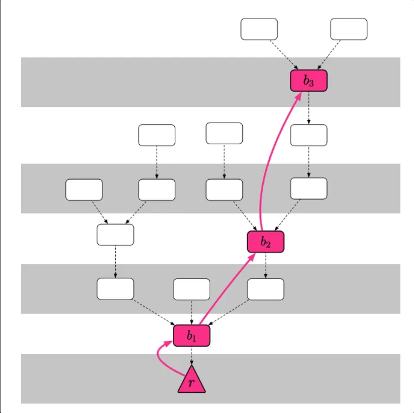

# Casper FFG

## 作用

可以理解为 PoS 的一种共识协议。
但是其设计呢又是脱离了之前的共识协议。
可以理解为是之前共识协议上面加了一层协议。
好处是可以做到 PoW 到 Pos 之间的转换，这个正是 ETH 需要的。

## 原理

### 思路
避免 PoW 大量的计算，Casper FFG 使用的是权益证明，需要权益质押，即质押一部分代币，当节点不按规则执行协议的时候会扣除一部分质押，显然惩罚的代币要大于作恶带来的收益（出块奖励）。

### 实现
Casper FFG 是一个覆盖链，只形成共识，具体出块机制由下层实现，底层吐出来检查点用于其进行共识。例如：把高度为0、50、100、150 的区块hash值取出，形成一棵新的树，如上图所示。最底部的检查点则称为根检查点（Root）。

### 共识机制
1. 参与质押的节点都可以成为验证者。
2. 验证者对检查点进行投票，投票信息：link(s→t)， s 和 t 代表前后依赖的两个检查点。
3. 超过质押总代币的 2/3 的节点（可能多少可能少数）投票之后， link(s→t) 成为绝对多数链接。
4. 成为绝对多数链接  link(s→t) 之后，t 进入 已证成（**Justified**）状态，s 进入已敲定（**Finalize**）状态，以此递归没两次投票之后，检查点状态 **New →** **Justified → Finalize**  完成 block 出块的确定。
5. 验证节点该对哪些检查点建立连结？**选择最高的「已证成」状态的检查点**。

### 惩罚机制
共识应该遵循以下原则，如果违背会进行惩罚，背景 **<ν, s1, t1, h(s1), h(t1)>，<ν, s2, t2, h(s2), h(t2)>，假设按权重计2/3的验证者没有违反惩罚条件**

1. 如果s1→t1和s2→t2是不同的绝对多数链路，那么h(t1) != h(t2)。
    1. 最多存在一个高度为n的合理检查点。
2. 如果s1→t1和s2→t2是不同的绝对多数链接，则不等式h(s1)<h(s2)<h(t2)<h(t1)不能成立
    1. 最多存在一个绝对多数链接: s→t，其中h（t）= n。

### 验证者切换
Casper FFG 能让任何存入押金的节点成为验证节点，因此**验证节点集合（Validator Set）**会动态地随着时间变化。

1. 每出一个检查点 Epoch + 1，跟检查点为 0。
2. 对于任何一个 Epoch 都有两个验证集合，前向验证集合 和 后向验证集合
3. 两个验证集合主要的目的是准确追责（可以对恶意节点进行惩罚）
    1. 例如在分叉情况，恶意节点可以在分叉链上作恶，但是无法惩罚
    2. 为此会规定 2 个 Epoch 之后才能取出质押，保证归档。
    3. 这里面归档可以理解为，保证在主链上，才能进行有效的惩罚
    4. 多数情况下前后验证集合不会有太多的变化，但是多数恶意节点共谋可能出问题
    5. 两个验证集合可以利用缝合机制解决这个问题
4. 当一个可能的验证者的存款消息被包含在具有朝代d的块中时，验证者ν将加入朝代d + 2的验证者集合。我们称d + 2这个验证者的起始朝代DS(ν)。
5. 要离开验证者集合，验证者必须发送“提款”消息。如果验证者ν的提款消息包含在具有朝代d的块中，则类似地将验证者将离开具有王朝d + 2的区块的验证者集合;我们称d + 2为验证者的结束朝代，DE(ν)。（一旦验证者ν离开验证者集合，验证者的公钥将被禁止重新加入验证者集合。这消除了处理单个身份的多个开始/结束朝代的需要。）
6. 前向集合：包括新加入的验证者，不包括离开的验证者（均包含延后的 2 个 Epoch）。
7. 后项集合：不包括新加入的验证者，包括离开的验证者（均包含延后的 2个 Epch）
8. 绝大多数链重新定义：前向集合 和 后项集合 都得到 2/3 投票，即都是绝大多数链。
9. 最终确定重新定义：绝大多数链接c→c'的投票以及证明c合理的绝对多数链（前一个链接）被包含在c'的区块链中（即C'包含抢两个链接的证明，才能确定C是最终确定的）。

### 安全性

1. 远程攻击（最长连攻击）
    1. 节点至少每4 个月要登入一次（押金要花4 个月提领）——没理解
    2. 节点直接拒绝4 个月以上的回朔
2. 灾难性攻击
    1. 假设大于1/3的验证者同时崩溃 - 即，由于网络分区，计算机故障或验证者本身是恶意的，它们不再连接到网络。
    2. 我们可以通过建立“不活动泄漏”来从这种情况进行恢复，这种泄漏会慢慢消耗任何不给检查点投票的验证人的存款，直到最终其存款规模减少到足以使投票的验证人为绝对多数。

## Vs. PBFT
1. 许可
    1. Casper FFG 任何人都可以成为验证者，但是通过质押也是需要知道全部验证的信息的。利用经济损失的风险来制约节点的行为，节点之间不需要任何信任基础也能共同运行协定，实现真正的去中心化。
2. 选主
    1. 只需负责形成共识，不需要关注底层出块，也不需要选主，下面根据原本机制自己出块。
3. 投票
    1. **New →** **Justified → Finalize** 类似三阶段提交，但是是流水线（pipeline 模式更像）
4. 抗攻击性
    1. PBFT 针对远程攻击和灾难攻击都没有解决方案。

## 参考
https://medium.com/taipei-ethereum-meetup/intro-to-casper-ffg-and-eth-2-0-95705e9304d6