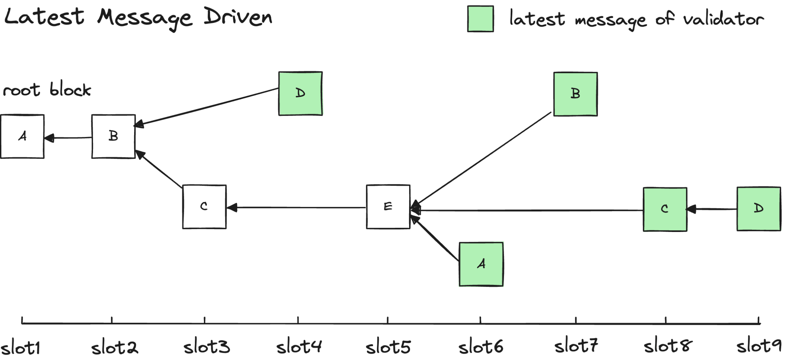
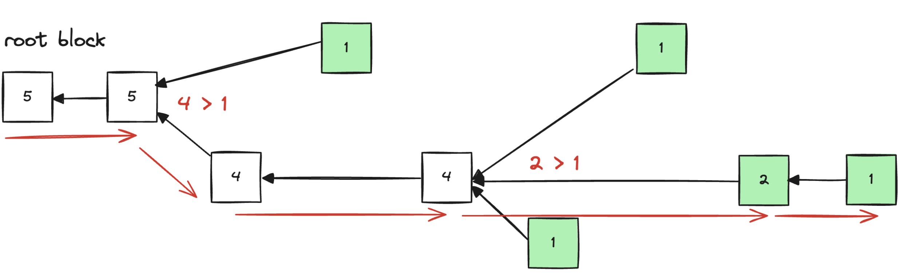
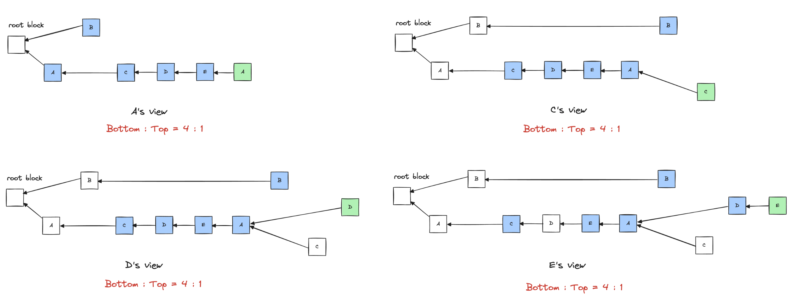
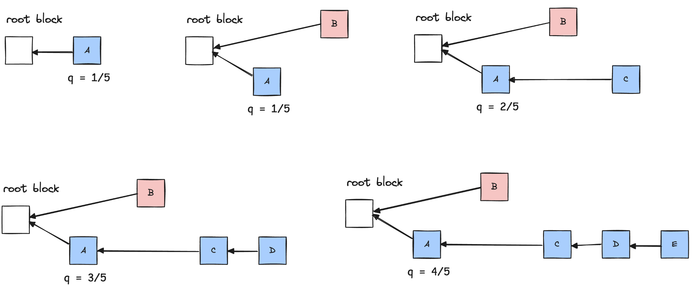

# Gasper

## Overview

以太坊从 2014 年开始研究从 PoW 转向 PoS ，直到 2022 年信标链与主网合并，以太坊的共识协议才正式从 PoW 切换到 PoS。本文讨论的正式转变成 PoS 过程中 ETH 社区的大致脉络和方案。探究设计过程背后的动因以及方案的形成才是理清脉络加深理解的根本。

## Bachground

### Core Question

PoW 转型 PoS 的核心难点是，攻击变得更容了，主要包括以下两类攻击：
* Nothing At Stake

   区块链会产生分叉之后，PoW 使用最长链原则。但 PoS 却不同，由于 PoS 的矿工不用耗费大量算力计算一个哈希值，所以负责出块的节点可以选择同时在多个分支之后出块，实际上这也是利益最大化的方法，无论日后哪个分支胜出，自己都可以获得奖励。

   对于 Nothing at Stake，Vitalik 在 2014 年 1 月份曾提出过用「惩罚」作为解决方案的核心思想，矿工需要押注某一个分支，如果该分支最终胜出则会获得奖励，如果失败则会丧失押金（[Understanding Serenity, Part 2: Casper](https://blog.ethereum.org/2015/12/28/understanding-serenity-part-2-casper)）。

* Long Range Attack

常见的长程攻击：
1. 第一种远程攻击，作恶节点在维护主链的同时，快速基于创世纪块出块，让其他验证者的位置出空块，只要伪造其时间戳就可以，这样自己伪造的链随着时间一定是最长链。
2. 第二种远程攻击，当验证者在主链上推出之后，不再是链的利益相关者，作恶者可以贿赂或者
盗取其私钥，从而基于创世纪块完成快速出块，此时除了作恶者本身还有其他节点出非空块，
这种攻击避免了伪造时间戳，也称作变节攻击。
3. 第三种远程攻击，作恶者仍然在主链上工作，但是在自己出块的时候拖延不出块，尽量拉长出块
时间，这样给其作恶争取时间，也会造成作恶链成为最长链。这种攻击会导致主链上作恶节点质
押的损失，也称作质押流失攻击。

**两种攻击的本质就是 PoS 付出的成本极低（相对 PoW）就可以获得可观的利益。**

Vlad 曾提出过一个简单的解决方案，认为节点提交了质押金之后它的签名才是有效的，这其实有一定道理，「你已经把质押金取走了，我凭什么还相信你？」。这就避免了节点取出质押金之后 Long Range Attack 无法进行惩罚的问题。然而这也意味着，一个区块的合法性不是通过历史区块就能验证的，还需要当前的数据，即有质押的节点列表。这就使得一个区块的合法性和时间产生了关系，一个现在合法的区块过几天就有可能变得不合法。这个设想的提出让 PoS 与 PoW 从根本上产生了区别：**区块的验证依赖了节点当下的状态**。

Vitalik 一开始不是很喜欢这个方案，他还是希望仅凭历史区块就能完成对一个区块的验证，但最后还是接受了，并提出了 [Weak Subjectivity](https://blog.ethereum.org/2014/11/25/proof-stake-learned-love-weak-subjectivity) 来解决 Long Range Attack。

### Weak Subjectivity

* 客观性指的是一个新节点加入网络时，仅仅知道如下两部分信息，就可以独立的得出与网络其他部分相同的当前状态。
   1. 协议。
   2. 所有已经发布的区块，及其他”必要“的信息。

* 主观性指的是，系统存在稳定状态，但是不同节点需要大量的社会信息才能确定，否则会得出不同的结论。

客观性的规则（协议）通过开源代码确认，发布的数据在网络中客观存在且自由流动，所以共识过程没有人为参与。
主观性则需要大量人为参与（社会信息，比如信誉等）。可以看出来两者完全是两个极端，一个完全没有人为参与，
一个是没有人为参与就无法达成共识。弱主观性其实就是介于两者之前，在客观性的基础上添加必要的少量的人为
参与部分。没有人为参与的部分是无法避免远程攻击的所以是主观的，大部分依靠客观性的两个条件推进所以是弱主观的。

* 弱主观：在客观性的基础上添加必要的少量的人为参与部分
1. 协议。
2. 所有已经发布的区块，及其他”必要“的信息。
3. 一个少于N个区块之前的已知有效状态。

其中一个确定的（finality）有效状态（距离最新块少于 N 个 Block）是弱主观性添加的，核心就是这个有效
状态之前的状态不可以在更改了，已经达成共识了，成本 chain 必要信息的一部分了。

*注意：弱主观性新加的条件也不是一定的（距离最新块之前 N 个 Block 的状态不会变更），因为还有可能是
51%攻击，弱主观性解决了远程攻击，但是没有解决 51% 攻击，这和 PoW 的安全级别是一样的。*

接下来具体看一下 PoS 基于弱主观性是如何工作的，首先新接入的节点可以人为（通过其他节点的网站）
获取最新的有效状态，设置一个 epoch 大于N，如果一个 validator 退出，必须在 2个 epoch 之后
才能提款，保证没有作恶（这也是 PoS 不用考虑短程攻击的原因，只关注短程总是有办法在主链上判断出作恶）。

**正是弱主观性的引入，使得 Vitalik 转向类 BFT 共识协议，因为类 BFT 共识协议具有即时敲定的特性。**

### Aiming Higher

类 BFT 共识协议对于 BFT 假设（1/3 恶意节点）是一个强依赖。但是太坊作为仅此 BTC 最优影响力的公链，Vlad 作为以太坊推进 PoS 共识的负责人，在 [The History of Casper — Chapter 4](https://medium.com/@Vlad_Zamfir/the-history-of-casper-chapter-4-3855638b5f0e) 中介绍了以太坊团队对于 Cartel Censorship Attack 的激烈讨论。

Vlad 和 Vitalik 等人在以太坊转向 PoS 之后计划打破 BFT 假设，并且不能牺牲去中心化（不可能三角）：当一个**协议哪怕只剩下一个节点也能恢复过来时，这个协议就是去中心化的**。

最后以太坊团队提出了 Gasper 协议，其实是将 Casper FFG 协议套用在改进后的 GHOST 协议上（LMD GHOST），前者负责在特定检查点最终确定一个区块（最终确定性），后者负责进行分叉选择（分叉选择规则）。
* 分叉选择规则：解决 Nothing at Stake 和 Long Range Attack 问题，同时避免 BFT 类共识容易丧失系统活性的问题。
* Finalized 规则：最终确定区块，在有限保证活性的情况下尽量具备安全性。

## Model

在正式介绍以太坊的共识协议 Gasper 之前，先明确以太坊共识的组成，每层的目的是什么，同时还需要了解以太坊共识运行的基本模型是什么样的，方便我们后面的理解。

* 以太坊 PoS 共识协议组成：
1. Propose Rule: 区块发布规则，负责打包区块并发布到链上 -- PoS。
2. Fork Choice Rule: 分叉选择规则，负责在多个分叉中选择出权威链（canonical chain），使系统状态的一致性得到保证，同时也为系统提供了活性 -- LMD GHOST.
3. Finality Rule: 最终确定性规则，负责最终敲定一个区块，使其永远无法被回滚（弱主观性的保证） -- Casper FFG。

2 和 3 在安全性和活性有一定的补充并不是功能单一，界限清晰的（后面接受）。

* 以太坊 PoS 共识基本模型：
1. Canonical Chain: 权威链，被 Fork Choice Rule 选中的分叉即为权威链。
2. Slot: Slot 是区块之间的最小间隔单位，相当于以太坊中的时间概念，共识是一个接一个 Slot 递进的。Slot 之间间隔为 12s，每个 Slot 出现时网络会尝试出块填充一个 Slot。
3. Root Block: Root Block 是应用 Fork Choice Rule 时的开始区块，比如最近一次已经具有 Finality 的区块。
4. Weight: 当一个 Proposer 被选中发布了一个新块之后，Validator Set 中的其他 Validator 需要对该块进行验证并投票，投票者的质押金表示了该投票的权重大小，投票权重的累加值即为该区块的权重大小。权重越大表示该区块所在的链得到了越多的认可。

以太坊会将整个网络的 Validators 分成 32 个 Validator Set，轮流对 32 个 Slot 出块，32 个 Slot 组成一个 Epoch，因此一个 Validator 在一个 Epoch 中只会参与一次出块。注意，Slot 和我们通常说的 Block height 不是一个概念，Slot 中可以有 Block，也可能没有 Block。

## LMD GHOST

以太坊的 LMD GHOST 只是 GHOST（The Greedy Heaviest-Observed Sub-Tree） 的一个变种，其原本目的是解决比特币扩容后频繁分叉（块之间发生冲突）造成的安全性下降问题。GHOST 的核心思想是：每个子块都是对其所有祖先的一次认可，，因此分支的所有子块都会被纳入权重，权威链的标准不再是 Longest Chain 而是 Heaviest Chain。

但是以太坊的共识除了 Fork Choice Rule 还有 Finality Rule（可以理解为确定了 Root Block），两个规则在选择 Canonical Chain 的时候会产生分歧，比如：Finality Rule 认定的权威链（大于 2/3 Staking）可能不是历史（从 Root Block 开始到当前分叉）累计 Staking 的最大值。Vlad 和 Vitalik 分别提出了 LMD GHOST 协议和 IMD GHOST 协议，IMD GHOST 协议不是基于权重的加和而是基于权重的最大值进行分叉选择，这里对 IMD GHOST 不进行过多介绍，感兴趣可以看[这篇](https://ethresear.ch/t/immediate-message-driven-ghost-as-ffg-fork-choice-rule/2561?u=benjaminion) Vitalik 的文章。

### Fork Choice Rule

LMD（Latest Message Driven） 表示在选取分叉时，只需要考虑每个 Validator 最近的一次投票(每个 Validator 都保存了所有验证者各自最新的那一次投票)，而不像 GHOST 那样考虑所有 Validator 历史上的全部投票，换句话说，LMD 仅考虑 Validator 最近一次投票的区块的权重并进行求和，而不会考虑整个子树上所有区块的权重。 

举例：

每一个节点都有所有验证者各自最新的投票，如上图所示。此时权威链接的计算如下图所示，只会用每个节点的最新一次的投票向上递归累加，其中路径最大的分叉（5->5->4->4->2->1）被认为是权威链。

注意：这里选取权威链的输入（所有验证节点的最后一次投票）与时间有关联（每个时刻 validator 可能是不一样的，可能加入可能退出），也就是上面提到的弱主观性的必要性的原因（需要一个 checkpoint 或者说是 finalized）。

### Sticky

LMD GHOST 具有 sticky 的性质：**节点一旦给某一个分支投票就倾向于继续为这个分支投票，除非一定比例的节点发生突然叛变（会收到惩罚）**。

诚实节点更倾向于沿着之前的权威链继续出块，而没有动力去频繁更换分支的选择，除非此时有两个节点发生「恶意叛变」，投票给上面的链，但这很容易被发现并收到惩罚。

上图中，B 是恶意节点，其他诚实节点倾向于在权威链上持续出块，D 和 E 的视图中之所以没有从 C 第二次投票之后继续出块可能是因为 D 和 E 并没有看到 C 的第二个块（网络延迟等原因），就算看到了也不会影响最后的分叉选择。这里也说明了即使是诚实的 Validator 也有可能没有把票投给最终的合法链（因此不应当受到惩罚）。

### Safety

前面提到过以太坊的目标是像打破 BFT 假设（少于 1/3 做恶），Casper FFG（Finality Rule）是一个类 BFT 共识的两轮投票，一旦 Casper FFG 失效或者做恶节点大于 1/3 （这里指的是 staking）依然需要保证 chain 的安全性和活性。

这个时候 Fork Choice Rule（即 LMD GHOST）需要保证 chain 的安全性和活性，所以以太坊的安全性并不是完全由 Finality Rule 保证，而是二者结合。

定义：安全值 Q，表示一条分支链得到 Validator 投票的权重与总 Validator 权重的比值。

假设 5 个 Validator 中有 4 个选择该分支，那么 Q=0.8。我们设 Qb 为 b这个块的安全值，那么从b
块发布开始，随着其子树上面的投票权重越来越大， Qb也会越来越高。一般认为当安全值大于某个阈值，即 Qb > Qmin 时，块 b成为了一个真正安全块，无法被攻击回滚。如下图:

对于 LMD GHOST 来说，阈值 Qmin 被定义为 β+12，其中 β 表示恶意节点控制的 Stake 权重值，一般来说认为小于 1/3。也就是说当 Validator 全部是诚实节点时，只要块 b收获一半 Validator 的认可，该块就会被 finalized。

如果恶意节点数量超过 1/3，Finality Rule 失效，客户端也可以自己判断当前安全性。如果客户端觉得当前区块的 Q 值过小，可以选择继续等待，等待 Casper FFG 执行成功或者**Q 值达到了自己的要求**。

客户端使用自己规则来定义 Q 值，而不用在协议中设置一个阈值常量，安全性和活性可以得到平衡。

### Incentives and punishments

1. Proposer 诚实选择分叉获取出块奖励，动力显而易见。
2. Validator 验证区块合法并签名投票，签名将会出现在下一个 Slot 的区块中作为证据被小奖励。
3. Proposer 收录签名也会得到小奖励，收集越多奖励越多，防止丢弃“不喜欢”的签名。
4. Validator 验证的区块不再权威链上，不会收到惩罚，因为由于网络等原因 validator 没有足够信息是可能的，并也浪费了他的计算资源，贸然惩罚是不公平的。

1. Validator Nothing at stake, 在多个分叉上投票，是易于检测的（Sticky），会收到惩罚
2. Proposer Nothing at stake, 通过第三方检测，提交证明，进行惩罚。

### Summary

以太坊 Fork Choice Rule 协议（LMD GHOST）打破了 BFT 假设，在 Finality Rule 协议（Casper FFG）失效的情况下依然可以在一定程度上保证安全性（通过累计 Q 值选择出安全的权威链），提供了活性（总是能选择出权威链，客户端在极端情况可以调低配置）。

## Casper FFG

Casper FFG 是一个两阶段的 BFT 共识协议，同时加入了 Stake 作为投票的统计权重（Stake 作为投票权重适合其他 BFT 类共识不同的地方，但是理解上和实现上都不复杂就不在这里过多介绍）。基于 [PBFT](./pbft.md)，[Tendermint BFT](./tendermint_bft.md)，[HotStuff](./hotstuff.md) 的介绍，在这里也不过多介绍为什么事两轮投票以及一些需要重点理解的知识点。接下来重点介绍 Casper FFG 实现模型，然后展开讨论。

### Model

* Casper FFG 的两阶段分别为 Justification 和 Finalization，都是需要收集到 +2/3 staking 的投票，对应 BFT 共识的 LockQC 和 CommitQC（广播式，而非 HotStuff 的主从式）。
* Casper FFG 每阶段的粒度是 Epoch 而非 Slot，每个 Epoch 的第一个区块称作 Checkpoint，对 Checkpoint 尝试进行 Justify 和 Finalize。
* Casper FFG 共识的内容不是交易，而是 Checkpoint 区块的 Finality 信息。
* 投票：s->t，一个诚实节点的 s 是它能看到的高度最高的 Justified Checkpoint，因此为 s→t 投票也包含了自己对该 s 已经 Justified 这个事实的认可，Validator 在验证提案时也需要验证 s 是否已经是 Justified。
* Supermajority Link：一旦 s→t 收集到超过 2/3 的投票， t 完成 Justification，s 完成 Finalization，此时我们说 s->t之间构建了一个 Supermajority Link。

### Minimum Slashing

V 神最早提出了 [四条削减规则](https://medium.com/@VitalikButerin/minimal-slashing-conditions-20f0b500fc6c) 防止节点作恶，但是最后精简为两条。

同一个验证者不可以进行以下任何一种情况中 [S1, T1] 和 [S2, T2] 的投票：
1. 区块高度(T1) = 区块高度(T2),或者
2. 区块高度(S1) < 区块高度(S2) < 区块高度(T2) < 区块高度(T1)

这两个削减的条件，就是让 Finality Rule 沿着权威链对 block 进行 finalized，反过来说就是不能分叉。所以要理解这两个规则是怎么保证的。

* 规则1: 一个节点不可以给不同高度投票，否则就会惩罚它，这个比较好理解，如果允许的话，可能造成两个分叉都获得 +2/3 的投票，那就分叉了。

1. 可不可能 S1 == S2，但是 T1 != T2，答案是可以，因为一个 s->t 的投票，其实是两个含义（pipeline的意义），代表对 s 的第二轮投票，对 t 的第一轮投票，不同的 t 相同的 s 也能表示 s 被 finalized 了，t 其实就是 BFT 类共识中的 LockQC 是可以被替换的（之前 PBFT，HotStuff 中有介绍），因为网络等原因 t 被替换了，但是 s 的 finalized 是生效的。此时之后基于 s 的其他 t1 收集到足够多的投票即可（此时如果 t1 在 t 之后同一个分叉上，那么 t 也相当于被 finalized，t1，t 不在一个分叉上，说明 t-LockQC 被替换了）

* 规则2: T2 和 T1 可能在不同的分叉上，此时如果允许那就造成一个节点给不同的分叉投票，所以要惩罚。

1. 如果 S1 == S2，T2 < T1，这是可以的（相当于 T1 或者 T2 有分歧是可以被替换的）规则1 里面有解释。
2. S1 < S2 < T1 < T2 可以吗？S1 和 S2 作为 source 一定都收集了第一轮的 +2/3 投票，如果 S1 < S2，那么一定会有 S1 -> S2 的投票，所以 S1 -> T1 的投票是不存在的，应该是 S1 -> S2, S2 -> T1/T2。(这个地方用反证法证明是最合适的，在这里只是做一下说明，尝试正向的理解，可能不严谨)。
3. S1 < T1 < S2 < T2 可以吗？不可以，因为投票不能跳，S2 -> T2 的前提是 S2 先收到 +2/3 的第一轮投票，S2 第一轮的投票一定是 T1 -> S2, 不能跳过 T1 的第二轮直接给 S2 投第一轮。

### Safety
两个相斥的区块 A 和 B 最终确定（且互不为对方的子区块）：
1. A = B，违背削减条件 1。
2. A < B，A能被确认，一定存在 [A,C] 收到 2/3 投票，B 能被确认一定是有一个序列都是收到 2/3 投票。这个序列任何一个点都不会和 A，C 相等否则违背削减条件 1。这个序列中一定存在一个 [Bn, Bn+1]，使得 Bn < A < C < Bn+1, 违反条件 2。

### Summary

Minimum Slashing 的意义是什么？其实就是在 +1/3 以上作恶节点的情况下，收到惩罚，这样就打破了 BFT 假设。根据 Minimum Slashing 规则，无论恶意节点有多大占比，只要其尝试进行分叉攻击以试图挑战某个已经被 Finalized 的 Checkpoint，就会与 Slashing Conditions 冲突。这是很容易检测的，那么我们就可以对其进行的巨额惩罚，并勒令其退出 Validator Set。这种因高昂的攻击成本迫使节点变得诚实而实现的 Finality 称为 Economic Finality。这个特性使得 Casper FFG 不允许「后悔」，一旦 Validator 投票给了一个分支，那么即使此时恶意节点权重突破 1/3，也不允许改变之前的选择。

总结：
1. 在 < 1/3 作恶节点的情况下，满足 BFT 假设，Casper FFG 的两轮投票可以保证安全。
2. 在 > 1/3 作恶节点的情况下，打破 BFT 假设，Casper FFG 的 Minimum Slashing 规则可以对作恶节点进行惩罚。

Casper FFG 是对 Finalize 进行共识，并不是对出块进行共识，所以在情况2下，Finalize 可能无法共识，但是 LMD GHOST（Fork Choice Rule）可以保持活性和一定的安全性。

## Summary

Casper FFG 是一个基于 BFT 共识改进的二阶段共识协议，除了拥有传统 BFT 共识的特性之外，它还利用 Validator 的质押保证了不满足拜占庭假设时的安全性（Economic Finality）。

以太坊共识协议由 PoS + LMD GHOST（Proposal Mechanism） + Casper FFG（Finality Rule） 组成，分别**实现了「交易共识」以及「Finality 共识」，并利用惩罚机制以及 Fork Choice Rule 分别解决了恶意节点超过 1/3 时 Safety 和 Liveness 丧失的问题——这才是重点**。

对比 PoW，以太坊的 PoS 更安全（拥有 Finality 和更高的攻击成本）、更快速（LMD GHOST 提升吞吐量）；对比 BFT 共识，以太坊的 PoS 活性更强（LMD GHOST 持续出块），整体安全性也更高（Casper FFG 的 Economic Finality）。

## Reference
[Proof of Stake: How I Learned to Love Weak Subjectivity](https://blog.ethereum.org/2014/11/25/proof-stake-learned-love-weak-subjectivity)

[Minimal Slashing Conditions](https://medium.com/@VitalikButerin/minimal-slashing-conditions-20f0b500fc6c)

[Casper FFG：以實現權益證明為目標的共識協定](https://medium.com/taipei-ethereum-meetup/intro-to-casper-ffg-and-eth-2-0-95705e9304d6)

[什么是CASPER FFG](https://blog.csdn.net/qq_40713201/article/details/124691252)

[Pos的远程攻击](https://www.elecfans.com/blockchain/930761.html)

[共识算法的比较-Casper vs Tendermint](https://blog.csdn.net/weixin_34112030/article/details/92410242)

[The History of Casper — Chapter 4](https://medium.com/@Vlad_Zamfir/the-history-of-casper-chapter-4-3855638b5f0e)

[以太坊的 PoS Part1: 共识协议纵览](https://www.xufeisofly.xyz/blog/ethereum-pos-p1)

[以太坊的 PoS Part2: LMD GHOST](https://www.xufeisofly.xyz/blog/ethereum-pos-p2)

[以太坊的 PoS Part3: Casper FFG](https://www.xufeisofly.xyz/blog/ethereum-pos-p3)