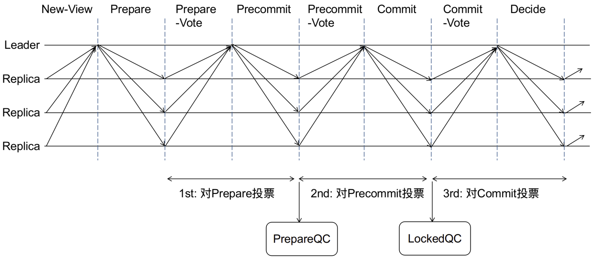
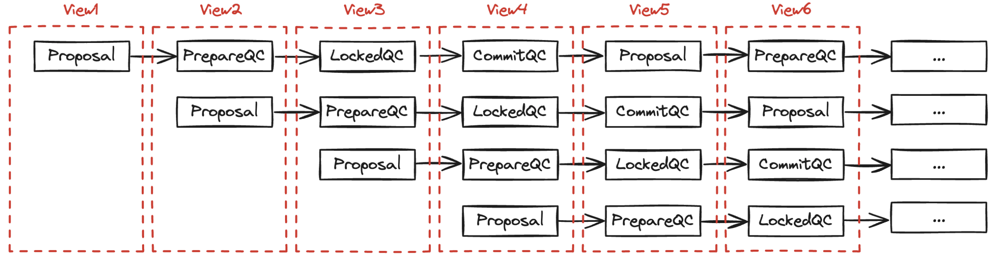

# HotSuff

## Overview

HotSuff 系列的共识，直接推动了区块链共识进程。HotSuff 最大的贡献是让安全性与活性解耦，安全性指的是 commit 的 proposal 一定会被执行（或者说在主链上），活性指的是持续出块不会因为协议的设计或者协议的安全要求导致出块卡主，可以让全网的 view 快速同步然后继续出块。在之前的类 BFT 共识中二者深度耦合，这也是比较好理解，视角切换全网状态必须熟练一致才能继续，否则存在安全风险。除此之外，HotSuff 将 view 切换的复杂度降到O(n)，通过三阶段的设计让 view 切换变成线性复杂度，并且与投票流程模式一样，使得协议简洁清晰。最后，三阶段的设计也使得其的[响应性](./partially_synchronization.md)更好。

## Constraint

1. 集合约束：n = 3f+1，且满足 BFT 模型，最多 f 个作恶节点， n - f 个正义节点。
2. 网络通信是点对点、经过认证且可靠的：不是 [PBFT 中的广播模式](./pbft.md#三阶段做了什么每个阶段目标是什么)，可以理解为集合信息会注册在一个合约中，节点间直连。如果中出现了“广播”，一定是表明经过校验且正确并将相同的点对点消息发送给所有其他节点。
3. 部分同步模型：系统存在一个不确定的GST（global stable time）和一个Δ，使得在GST结束后的Δ时间内，系统处于一个同步状态。
4. 密码学原语：阈值签名，目前业界多数使用 BLS 聚合签名，在协议理解阶段可以简单理解为多个 singer 对消息进行签名，然后任意节点可以验证签名正确性，详解见[BLS 签名与在 HotSuff 中的应用](https://www.xufeisofly.xyz/blog/bls)。
5. 复杂度度量：关注的复杂度度量是节点复杂度。

## HotSuff Flow

### Basic HotSuff

1. Prepare  
    1. 每个 view 开始时，新的 leader收集由(n−f)个副本节点发送的 NEW-VIEW 消息，每个 NEW-VIEW 消息中包含了发送节点上高度最高的 PrepareQC(如果没有则设为空)。
    2. Leader 从收到的 NEW-VIEW 消息中，选取高度最高的 PrepareQC 作为 HighQC。
    3. Leader 节点会在 HighQC 所在的安全分支来创建一个新的区块，并广播 proposal，proposal 中包含了新的区块和 HighQC ，其中 HighQC 作为 proposal 的安全性验证。
    4. 其他节点一旦收到当前 view 对应 leader 的 proposal 消息，进行 safeNode-predicate 规则检查。
        1.  Proposal消息中的区块是从本机 LockQC 的区块扩展产生（即 m.block 是 LockQC.block的子孙区块）
        2. 为了保证 liveness, 除了上一条之外，当 Proposal.highQC 高于本地 LockQC 中的 view_number 时也会接收该proposal。
        3. 二者满足其一即可
    
    Prepare 阶段有两点需要注意：
    * 根据 PreparedQC 选择 HighQC 并在其后面追加区块。
      
      选择 PreparedQC 更新 HighQC 然后基于 HighQC 出新块，这是为了保证 chain 的活性，不必等待最终的 LockQC 。如果投票发生超时等异常，最新块和 finalized 区块之间的距离会变大，正常会差3个块（后面介绍）。还有一种可能就是会发生分叉，但是随着 LockQC 的推进会 revert 掉侧链。 

    * safeNode-predicate 规则
    
      规则1: 描述了新区块必须在 LockQC 之后，并且无冲突（扩展表示各种校验通过）。
      规则2: 是为了保持活性，如上述情况在 LockQC 无法正常推进的时候可以保证正常出块。
      

2. Precommit
    1. Leader 发出 proposal 消息以后，等待 (n−f) 个节点对于该 proposal 的签名，集齐签名后会将这些签名组合成一个新的签名，以生成 PreparedQC 保存在本地。
    2. Leader 将 PreparedQC 放入 PRECOMMIT 消息中广播给节点。

    Precommit 阶段有两点需要注意：
    * 当前节点与其他节点不是对等节点，与 [PBFT](./pbft.md#analysis) 不同，非对等节点不需要其他节点直接的广播，而是 leader 下发投票结果，通知全网进展到哪一步了（正式前述的[点对点网络](#constraint)）。
    * 投票的签名使用的是[阈值签名](#constraint)，利用各自的私钥份额签名，避免了同一个消息需要需要签名多次，并分别验证才知道 (n-f) 个节点的认可。
    * 总结：HotSuff 的一轮同步，其实需要经过两轮网络交互：
        1. leader 发送消息，其他节点签名返回给 leader。
        2. leader 收集 2/3 之后，将投票结果同步给其他节点。
        3. 不像 PBFT 对等网络模型，每轮投票都是各自收集自己的投票信息。

3. Commit
    1. Leader 先收集(n-f)个 precommit-vote，将其组合为 PrecommitQC,并将其放在COMMIT消息中广播。
    2. 其他节点收到 COMMIT消息时，会对其签名 commit-vote，然后回复给leader。
    3. 最重要的是是，此时节点会将 PrecommitQC 锁定为 LockQC（相当于 LockQC 向前推进了）。

    Commit 需要注意两点：
    * 为什么 PrecommitQC 可以推进 lockQC？

      先回忆一下 PBFT 三阶段都干了什么，完成了什么？类比一下 HotSuff 可能会搞清楚答案。PBFT 有三个阶段，但是只有两轮投票，Prepare 阶段全网对等节点互相广播投票锁定消息的位置，Commit 阶段全网对等节点广播投票确定消息可以执行。HotSuff 特殊点在于他不是对等节点的广播模型，而是 leader 下发消息->收集投票->同步QC 的主从模式，所以与 PBFT 的每个阶段或者每轮投票不能直接类比，但是我们可以通过投票轮次的目的来类比。

      为了更好的描述这个类比过程，我们用上述流程图中每个子阶段的名次来描述。
      1. Prepare-Vote + PreCommit 对于消息位置完成了全网信息同步(收集投票并下发)类比 PBFT 的 Prepare 阶段。
      2. Precommit-Vote + Commit 对于要执行消息这个动作完成了全部信息的同步（收集投票并下发）类比 PBFT 的 Commite 阶段。

      所以，在 Commit-Vote 之后，每个节点本地都会确定“要”执行（要执行但为执行）这个消息，此时“要”执行这个想法在全网都是确定的，所以可以设置 LockQC，即锁定。

    * Commit 阶段做了什么？类比 PBFT 算是那个阶段？

      相当于 PBFT 中第一个阶段，锁定要执行的消息。很自然会想到，PBFT 两轮锁定，HotSuff 需要三轮锁定，为什么？后面[View Change](#view-change)部分介绍。

4. Decide
    1. 当 Leader 收到了（n-f）个 commit-vote 投票，将他们组合成 CommitQC，广播 DECIDE 消息。
    2. 节点收到 DECIDE 消息中的 CommitQC 后，认为当前proposal是一个确定的消息，执行。
    3. Viewnumber加1，开始新的阶段。

    为什么需要 Decide 阶段？HotSuff 的主从网络模型，需要通知其他节点 CommitQC 已经生成，可以执行了。

#### View Change

HotSuff 最大的贡献之一就是 view change 做到了线性复杂度，做到这一点就是依赖其 Prepare 阶段生成的 PrepareQC。View change 时只需要等待 (n-f) 个节点的 HighQC 之后选择最高的 HighQC 即可开始新的 view（n-f 个节点的 HighQC 一定能获取到前 view 的最新消息）。等待 (n-f) 个节点的 HighQC 这个过程是线性的，后续的 Prepare 阶段需要带上这个 HighQC 让全网认可新 leader 的 proposal（正常轮换和异常切换都需要）。

“等待 (n-f) 个节点的 HighQC” 这是一个很重要的点，涉及到部分同步模型以及 HotSuff 变体系列的理解，在[Partially Synchronization](./partially_synchronization.md) 部分有详细介绍。

**这里值得重点介绍的是，HotSuff 的三阶段哪一个阶段是新引进的？目的是什么？**

在前面 Commit 阶段介绍过 HotSuff 与 PBFT 阶段的类比，HotSuff 在 Precommit 阶段进行锁定，在 Commit 阶段提交，PBFT 在 Prepare 阶段锁定在 Commit 阶段提交，所以 HotSuff 的 Prepare 阶段是新增的阶段。

分阶段提交的本质其实就是“锁定->提交”，HotSuff 的 Prepare 阶段其实就是为了线性 view change，从上述流程介绍中可以看到在初始阶段需要收集(n-f) 个节点的 HighQC（异常情况下--前一轮未达成共识，超时需要进入下一个 view--也是从等 (n-f) 个节点的 HighQC 开始）。接下来讨论为什么两轮投票不可以，即使用 LockQC 而不是 PrepareQC?

假设 HotStuff 只有 2 阶段（锁定->提交，没有 Prepare 阶段生成 PrepareQC）假设：A, B, C, D 四个节点：
1. A 作为 leader 基于 Block0 出块 Block1，收集到多是投票之后（A 锁定 Block1）还未广播之前（其他节点未锁定）宕机。
2. 新 leader D 收集 B, C, D 的结果基于 Block 0 产生新区块 Block1'，此时 A 恢复之后不会接受 Block1'，产生分叉——**安全性被破坏**。

假设 B 是恶意节点（满足 3f+1 假设）并且 A 恢复为 leader。
1. B 给 D 的投票隐藏了 Block1，C, D 会锁定在 Block1'。
2. B 给 A 的投票基于 Block1，A 锁定在 Block1，永远无法达成共识——**活性被破坏**。

所以，view change 阶段，最重要的目的是需要全网达成 view 共识然后继续出块。HotSuff 引入的 Prepare 阶段（有的文章或者论文中成为 KeyQC 阶段，本文统一就是 PrepareQC），他的作用就是在 view change 阶段收集 2f+1 的 PrepareQC，这样可以确定最新 view 然后继续，为什么 2f+1 的 PrepareQC 就可以呢？因为 PrepareQC 的生成已经得到 2f+1 的投票（Prepare 阶段内容），收集 2f+1 的 PrepareQC 就一定不会错过最新的 PrepareQC（HighQC），而“收集2f+1 的 PrepareQC”过程是线性的，所以 HotSuff 完成了线性 view change，保证了安全性和活性。

其实 [PBFT](./pbft.md) -> [Tendermint BFT](./tendermint_bft.md) -> HotSuff -> HotStuff 优化系列，核心解决的就是 view change，详细的对比还是会在 [Partially Synchronization](./partially_synchronization.md) 这里介绍。另外一个问题就是工程实现上“收集2f+1 的 PrepareQC”过程虽然是线性的，没有像上述其他共识引入更高的复杂度，但是仍然存在一个死等的问题影响活性，即“收集2f+1 的 PrepareQC”总是超时或者说时间无限长（GST 不收敛-Partially Synchronization And Responsiveness 会重点理解），怎么解决？

常见的工程实践就是 TC(Timeout Certificate)，当节点判断当前 view 超时会发送 TimeoutMsg（with CurView）给新的 leader，当新 leader 收到 2f+1 个 TC 的时候，开启新的 view。虽然也需要 2f+1 与 PrepareQC 不同的是，节点如果卡在了中间某个阶段可能需要很长时间，TC 给整个过程加了一个超时（有点类似 PBFT）。另外一点就是有了 TC， view 一定会推进，只有 PrepareQC 在异常情况下 view 没有变。TC 相当于在超时之后对 view 进行共识。

### Satety && Liveness

##### Satety
1. 同一个 View 下，不会对冲突的区块，产生相同类型的QC
    
    在同一个 View 下相同类型的 QC 都被 2/3 阶段确认，违背了 BFT 原理。

2. 正常节点不会 commit 冲突的区块

    同 view 间不会冲突，如上所述。不同 view 间 commit 了冲突区块，即分叉（因为是 commit 即确定为主链的区块）。这部分应该由 Prepare 阶段的 safeNode-predicate 规则保障，即两个规则都违背了（因为两个规则是或的关系）。

    如果两个冲突 commitQC 都成立，那么在两个 commitQC 之间一定出现了冲突的 prepareQC 违背了规则1，因为规则1 规定了新区块由 lockQC 区块扩展产生，在执行验证阶段一定会失败。规则2为了保证活性，在分叉（未最终确认 finalized, prepareQC 可以返回导致的--前一轮没有 commit，统一轮次可以投多次）的情况下可以接受更高的 highQC，如果发生了不同 view 下提交了冲突 commitQC 那一定会在相同的块高下有两个 commitQC 也与前述矛盾。

    更系统的公式化反正法证明不在这里赘述了，理解含意是本文的重点。

### Analysis

#### Three-Phase or Four-Phase？

通过 Basic HotSuff 的描述像是需要四个阶段完成一轮共识，但是都是 HotSuff 是三轮完成共识，其实这里有两个点造成了迷雾。

在工程实现中 New-View + Commit-Vote 可以合并在一个网络回包中，Prepare + Decide 可以合并到一个网络请求中，这样 Prepare + Prepare-Vote, Precommit + Precommit-Vote, Commit + Commit-Vote 就是三阶段完成一轮共识，确认一个 finalized block。

上述的解释对于看流程图是比较规整的三个阶段，但是类比 PBFT 的三个阶段又是不一样的，因为他们的网络模型不一样，一个是对等节点，一个是主从式，所以上述的描述三阶段与 PBFT 的三阶段是不能对等上的，如前所述：
1. Prepare-Vote + PreCommit 是 HotStuff 为了线性切换 view 新增的 PrepareQC(或者 KeyQC) 阶段。
2. Precommit-Vote + Commit 类比 PBFT 的 Prepare 节点，锁定 LockQC。
3. Commit-Vote(+ Prepare) + Decide(+ Prepare) 类比 PBFT 的 commit 节点执行 CommitQC。

这三个阶段的划分方法才是 HotSuff 共识经常被讨论的三阶段，因为这三阶段发生了"投票"。**三轮投票决定了，在正常情况最新区块与finalized区块之间的距离是3**。这也是社区优化的目标，三轮变两轮，甚至两轮变一轮加快 finalized 的速度。

#### PrepareQC, LockQC and CommitQC 

PrepareQC 前面描述很多了 HotStuff 为了实现线性切换 leader 相比其他类 BFT 共识的两轮投票新增的一轮投票，其中 HighQC 是最新的 PrepareQC 标识（本地视角看到的最新值）。

LockQC 类比其他类 BFT 共识的两轮投票中第一轮投票的结果，即锁定等待执行。这里指的说明的是 LockQC 一旦锁定就不会被 revert 吗？前面的 view change 中其实有所涉及，在异常情况下是可以被 revert 的，因为安全规则中活性的规定“当 Proposal.highQC 高于本地 LockQC 中的 view_number 时也会接收该proposal”。举例：当一个节点锁定在一个 QC 上，其中有 f 个恶意节点的投票然后离线很久，其他节点正常推进（推进期间恶意节点没有做恶或者至多 f-1 个做恶），此时节点恢复网络链接之后发现之后的 PrepareQC 比之前的 LockQC 高，就会利用上述规则替换。其实 LockQC 被替换的规则在 PBFT 和 Tendermint BFT 中也都有，比如 Tendermint 中的 Round 概念就是，所以 LockQC 只是锁定要执行的，但不是一定被执行，只有 CommitQC 才是一定会被执行。 

CommitQC 代表执行即使只有一个节点之前其他节点都没有执行，全网都必须要执行，因为已经 2f-1 个节点收到了对应的 LockQC 并回复了，view change 之后 LockQC 对应的 PrepareQC 一定不能被藏住，被新 leader 看到。

### Chained HotStuff

在basic hotStuff中，三阶段投票每一阶段无非都是发出消息然后收集投票，那么可以使用如下的方式简化协议。
1. 在Prepare阶段的投票由当前view对应的leader1收集，集齐后生成prepareQC。
2. 然后将prepareQC发送到下一个view的leader2那里，leader2基于prepareQC开始新的prepare阶段。
    1. 这是leader2的prepare阶段，同时也是leader1的precommit阶段。
3. 以此类推，leader2产生新的prepareQC,然后发送给下一个view的leader3，
    1. leader3开始自己的prepare阶段，同时也是leader1的commit阶段、leader2的precommit阶段。

* 1-chain: 有新的prepareQC形成，更新本地的prepareQC
* 2-chain: 有新的precommitQC形成，更新本地的lockedQC
* 3-chian: 有新的commitQC形成，有新的区块分支进入commit状态，执行确认的区块分支

所以三个区块就可以敲定之前 n-3 的区块。

## Summarize

总结一下 HotSuff 的特性：
1. 投票的网络模型，主从式而不是 PBFT 的对等模式 + 引入了阈值签名或者聚合签名（相比 PBFT 降低了 view change 的消息大小）+ 三阶段（新引入的 KeyQC）实现线性 view change，三者一起降低了复杂度为 O(n)。
2. 线性 view change 复杂度O(n)，并且统一了投票与 view change 的模式（都是投票方式），降低了实现复杂度。
3. 响应性更好，协议速度与网络真是情况相关，协议没有额外的固定超时时间等引入复杂度，[Partially Synchronization](./partially_synchronization.md)详细介绍。
4. 安全性与活性解耦，PBFT, Tendermint BFT 在正常的 Happy Path 上运行都是没问题的，但是在异常情况下 view change，安全性与活性就会发生干扰二者互相牵绊，但是三阶段的 HotStuff 由于新增的 PrepareQC 或者是 KeyQC 让这个过程不仅实现简单（收集 HighQC 与投票模式相同且 O(n) 复杂度），并且安全性与活性解耦。Pre-Commit 让 2f + 1 个节点见过 HighQC，Commit 锁定了 2f + 1 个节点见到了 QC，这样异常切换情况下看到 HighQC 就保证了活性。同时节点在本地根据简单的 safeNode-predicate 规则保证安全，无需额外的网络请求等。二者完成解耦，Pacemaker 符合 view 推进，safeNode-predicate 负责节点本地的安全，二者不互现牵扯。详细的介绍见[Partially Synchronization](./partially_synchronization.md)详细介绍。

HotSuff 算法专门为区块链场景设计，并且算法结构简单，成为目前最主流的共识算法基础。很多业界的算法都是在 HotSuff 的基础上进行改进，改进的方向基本是三阶段变成两阶段可以更快的 finalized block，多数牺牲了线性 view change ，主要是因为多数情况下协议在 Happy Path 下运行，在 Unhappy Path 的时候偶尔付出一些代价对于系统的活性略有影响可以接受（上述多数是理论介绍，在工程实践中多数有类似 TC 的实现，所以 Unhappy Path 情况下，优化算法效果工程实践上可能会更好，因为上述理论中 GST 这个理论性的变量在实践中可能不会让问题快速收敛）。总之，HotSuff 作为基础理论指的我们深入的学习和理解，在此基础之上才能理解其他变种。

## Reference

[HotStuff: BFT Consensus in the Lens of Blockchain](https://arxiv.org/pdf/1803.05069)

[HotStuff 共识算法详解 ](https://www.cnblogs.com/gexin/p/12031954.html)

[HotStuff 工程设计与实现](https://www.xufeisofly.xyz/blog/shardora-hotstuff)