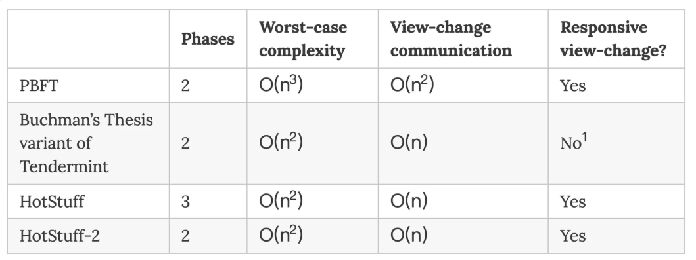

# Partial Synchronization

## Overview

类 BFT 共识都是基于“部分同步”网络模型，本文通过“部分同步”模型为侧重点对之前介绍的 [PBFT](./pbft.md)，[Tendermint BFT](./tendermint_bft.md)，[HotStuff](./hotstuff.md) 尝试更深入的理解。

在介绍“部分同步”模型之前，需要先明确“同步”，“异步”，“部分同步”的含义，以及共识算法为什么引入“部分同步”。
1. 同步：消息从一个节点发送到另一个节点所需要的时间存在一个固定的、可知的上限。
2. 异步：不存在那个固定的时间上限，时间可以无限长。
3. 部分同步：假设存在一个全剧稳定时间，称为 GST，在 GST 时刻之后，认为整个系统达到如下状态：所有诚实节点发送的消息会在一个时间 ∆ 以内必定被接受。

异步，异步系统中无法准确的给出一个时间参数，使得节点的消息会在该时间内被接收，消息时延完全依赖于网络情况，一个诚实节点发出的消息可能经过 1 万年才能被收到，虽然很夸张，但异步系统需要处理这些情况。[FLP不可能原理](./flp.md) 已经证明在纯异步系统不存在一个可以解决一致性问题的确定性共识算法。

同步，同步系统中有一个“固定”的时间上线，在这个时间之内消息一定会达到，这个“固定”就会导致系统的性能比较差，因为没有反应出实际的网络情况。一个典型的同步网络就是 BTC 的 PoW 共识，它认为这个时间上限是 10 分钟，即默认 10 分钟一定可以令所有的节点收到矿工的消息。我们假设 10 分钟的出块时间缩短至 10s，那么系统就会频繁出现分叉（当然有最长链原则），继续算短出块极限情况下，每个节点都可能有自己的分叉，于是共识出现不一致性，共识的 Safety 丧失。

部分同步，同样也有一个时间上限但不固定，不固定的部分就是 GST(Global Stabilization Time)，在 GST 之后 ∆ 以内必定到达，这也是最符合现实情况的场景。在工程实践中这个不固定的时间上线，是通过调整 Timeout 进行适配的（超时就扩大，还可适当缩减），共识算法需要做的是基于“部分同步”模型（符合现实情况），在设计上不破坏共识的安全性，尽量保证活性（同步模型就会破坏安全性）。

至此，需要明确两点：
1. 部分同步，符合现实情况。
2. 共识算法需要保证在GST之前（异步期间）共识的安全性。

## GST

GST 其实是一个理论性概念，在工程实践中是体现不出来的，它的意义是让协议在设计阶段保证共识的安全性。保证设计的完整性（或者说安全）。在工程实践中 ∆ 才是抓手，我们并不知道 GST 何时结束，但是可以在一个实践上可行的时间点设置 ∆ （也就是超时，后面都用超时来描述）是可行的：在工程实践中某一个时间点是 GST 结束，此时设置超时即可，或者设置一个整体的超时其代表了 GST + ∆。在一轮共识中，如果因为超时，可以进行 view change 进入下一轮共识，但是协议需要保证其安全性，寻求下一轮共识达成，当然会丧失一定活性。

接下来，我们看一下常见的共识算法的实现是怎么体现“部分同步”模型的。

#### PBFT

PBFT 被设计为在异步环境中保证安全性，但在部分同步环境下才能保证活性。
1. 安全性：不依赖于任何关于消息延迟的假设。只要诚实节点数量超过 2/3，无论网络多慢，它都能保证一致性。
2. 活性：为了在领导者故障时恢复共识，PBFT 使用了指数退避超时机制。当视图切换发生时，超时时间会不断翻倍，直到网络恢复稳定并足以让节点在超时前完成通信，共识才会恢复。

"所有节点有一个超时时间"，没有收到响应就会发起 view change，这个 view change 也是分三个阶段：

* VIEW-CHANGE  阶段
1. 停止处理抢钱视图的所有请求。
2. 发送 VIEW-CHANGE 消息给所有节点
    1. 消息包括：Checkpoint，CheckpointQC，PrepareQC。

* New-View 阶段
1. 新 leader(可预测)，收集 2f+1 个 VIEW-CHANGE 消息，计算出新 PrepareQC。
2. 广播给所有节点 New-View 消息
    1. 包括 2f+1 个 VIEW-CHANGE，以及计算出来的 PrepareQC

* Recovery 阶段
1. 其他节点收到 NEW-VIEW 消息后，验证该消息的合法性
2. 进入视图 (v+1)
3. 处理新 leader 重发的提议

"所有节点有一个超时时间"其实就是部分同步中的“GST+∆”:
1. 超时没接收到 Pre-prepare 消息。
2. Prepare 或 Commit 阶段 超时没有接收到制定数量的消息。
3. leader 发送冲突的消息。

#### Tendermint BFT

Tendermint BFT 在 PreVote 和 PreCommit 两轮投票中，都是先收集 2f+1 的任意投票，之后设置超时时间在判断所有的投票中是 2/3+1 赞成还是反对，这个超时就是为了收集更多的投票。“2f+1 的任意投票”就是它认为 GST 结束的时间，后面的超时就是 ∆。

在 Commit 阶段中 NewHeight -> NewRound 也有一个超时，这个超时是为了 view change(不区分 Happy Path 和 Unhappy Path)阶段收集全部节点的 LockQC ，收集全部就是当值隐藏锁的情况（详见[Tendermint BFT](./tendermint_bft.md)）。在这里的超时就是 “GST + ∆”。

#### HotStuff

HotStuff 在实现中有一个 Pacemaker 模块，当前 view 内超时为达成共识，预设的新 leader 会使用的 PrepareQC(可能有 TC 机制保证，详见[HotStuff](./hotstuff.md))，进行下一轮共识。这里其实简化了模型，无论哪个步骤无法收敛直接切换，相当于这个超时代表了 “GST + ∆”。能简化这个模型的基础就是三阶段中第一个阶段的 PrepareQC(或者 KeyQC)，因为 PrepareQC 一定被 2f+1 个节点认可，下一轮直接收集这个即可继续，无论是否 LockQC 或者 CommitQC。

值得介绍的是，正是这样简化了的模型，是的安全性与活性结偶，只要新 leader 收到 2f+1 个 PrepareQC 就可以继续推进（Pacemaker 通过超时推进新 leader），安全性完全由 Precommit 阶段的 LockQC 逻辑保证（safeNode-predicate 规则）。即使频繁切换，Pacemaker 只负责推荐不管对错，safeNode-predicate 决定是否接受。PBFT 和 Tendermint BFT 的 view change 阶段需要收集很多信息保证数据不丢（安全性），他们的安全性与活性的耦合就比较深。

### View Change Complexity

三个算法的复杂度，其实不是严格的对齐，在这里有必要讨论一下。

* PBTF
1. 消息大小：NEW-VIEW 消息包含了 (2f+1) 个节点的 VIEW-CHANGE 消息。由于每个 VIEW-CHANGE 消息里又包含了若干个尚未确认的提案证明，这个消息包非常大。
2. 广播开销：领导者将这个极其庞大的证明包发送给所有 n 个节点。
3. 计算复杂度：每个节点都要验证这个大包里的 (2f+1) 个签名以及所有包含的提案状态。

通信开销达到 O(n^2), 算上计算复杂度 O(n^3)

* Tendermint BFT
1. 收集 n 个阶段的 QC
2. 广播 n 个节点，每个节点“若干”个签名或状态数据。

通信开销达到 O(n^2)

* HotStuff
1. 收集 2f+1 个 PrepareQC
2. 使用聚合签名或者阈值签名，只有一条消息
3. 通知 n 个节点 new view。

通信开销达到 O(n)

所以，聚合签名或者阈值签名在 HotStuff 中起到了降低复杂度的作用，较少了消息大小。

## Responsiveness

如前所述，三阶段的 HotStuff 在 Prepare 阶段其实就是保证 2f+1 个节点先看见新的 proposal，这样 view change 阶段就可以轻便（无须多轮交互和复杂的 QC 用于切换）完成 view change，而不像 Tendermint BFT 等待一个固定的超时，这种“谁快跟谁跑”的特点，让其响应性更好。

可能会说在网络好的时候收集全部节点不必等待超时时间到也可以继续，也能有响应性，其实这里是一个理论性的讨论，想表达的是 Tendermint BFT 并没有 HotStuff 这种响应性那么好。工程实践上肯定是可以这么做但是 +2/3 的 HotStuff 必然优于等待全部的性能，并且理论上认为设置的超时时间就是等待全部 LockQC 的最小值，所以定性的理解一下就可以，在实践中就是等 2/3 优于等全部。

## Summary

