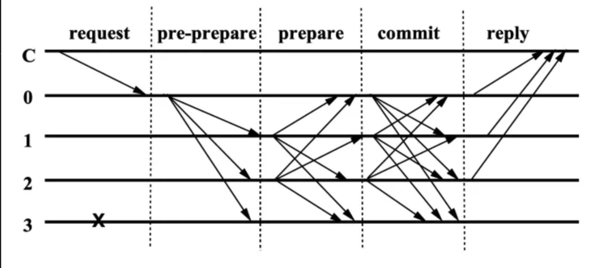

# PBFT

## PBFT 原理

1. Pre-Prepare
   1. leader 接受消息，然后发送“就位”消息，包括[epoch，index，message，sign]，
   给其他的验证者。
2. Prepare
   1. 验证者收到预备消息之后，决定是否接受。
   2. 接受的话，发送签名的“预备”消息，否则不发送任何消息
   3. 当验证者收到 2/3 的“预备”消息，进入 Prepared 状态
      1. 收集的“预备”消息，成为“已预备证明”
3. Commit
   1. Prepared 验证者决定是否要执行消息
   2. 执行的话，发送签名的“执行”消息，否则不发送任何消息，进入执行阶段
   3. 当验证收到 2/3 的“执行”消息，执行消息，进入已执行状态

* Prepare 阶段作用是什么？

   Prepare 阶段收集了 2/3 的 “预备”消息，消息的内容必须是一样的，只是来自不同验证者的签名。
   所以 Prepare 最重要的事情就是确保大多数（2/3）收到相同的消息（视域，消息位置，消息内容）。
   还有一个重要的事情是收集 “已预备证明”，后面切主的时候会用到，防止消息丢失。

* Commit 阶段作用是什么？

   只有 Prepared 的验证者才能发送执行消息，这样保证了计划执行的消息与之前 Prepare 的消息相同。
   所以，Prepare 阶段是大家需要执行什么消息达成共识，Commit 保证执行 Prepared 的消息。

* 为什么需要三个阶段？

   正如前面所述，Prepare 主要是对于需要共识的消息达成一致，并且记录下来（“已预备证明”），好处就是
   切换新主的时候，Prepared 消息也不会丢失。如果是两阶段，对于要执行的消息没有过共识，很可能就会丢失。
   例如：leader1 发送消息直接收集“已预备证明”，并且收集到 2/3 直接执行，另外 1/3 的将军没有看到
   这条消息，并且发起了（恶意或者非恶心）切主，由于其他节点没有收集“已预备证明”（两阶段是不会让所有的节点收集预备证明，只有一个节点收集，pre-prepare 和 prepare 合并到一起了）
   leader2 没有这个消息就会发送新的消息给 leader1，结果就是在同一个位置上 leader1 执行了两个消息。

   三阶段由于所有节点都会收集“预备证明”，就可以保证切主的时候，Prepared 的消息不会丢失。

### 检查点

一般情况下，每个结点需要保存所有的历史数据和状态机的每个历史状态，以便在需要的时候可以复查。
但随着系统运行的时间越来越长，数据就会越来越多，最终肯定有存不下的情况。所以我们需要一种机制，
可以放心的丢弃以前的历史数据，又不致于影响系统的运行和结点间的信任。

检查点肯定是需要所有验证者达成共识，否则每个节点的检查点不一致，在换主的过程中会有数据的丢失。
检查点的创建可以不用三阶段，任何一个验证者需要创建的时候只需要发出消息并收集 2/3 的赞成签名。
创建消息需要包含位置，hash 等信息，收集的赞成签名消息会成为稳定检查点证明（这个在切主的时候会用到）。
证明一个 checkpoint 获得了 2/3 的认可，在选注的时候会作为条件之一。

检查点的推进可以是区间方式的，新的检查点大于前一个证明过的稳定检查点即可。

#### 换主

1. 收到“预备”消息，到执行完会设置一个定时器，超时的话所有验证节点会发起签名的“变换”消息。
2. 先收到 2/3 赞成“变换”消息的验证者会成为新的 leader。
3. 新的 leader 会发送“新域”消息，消息带有自己的“已预备证明”。
4. 其他节点执行“已预备证明”的 Prepared 消息。

注意：
1. 验证者投票一定有一些规则，比如选择检查点/ index 最大的，等（类似 Paxos 等）这里简略了。
2. leader 超时会发起切换，对于 leader 作恶并没有机制保证安全性。

## 正确性分析

PBFT 的安全性主要来自两个点：
1. 拜占庭问题的结论，2/3 以上的诚实节点。
2. 三阶段，做到了对于需要执行的消息先达成共识，再保证执行达成共识的消息，防止因切主造成消息混乱。

PBFT的活性，其实就是在超时情况下的切主，这是对 [FLP](./flp.md) 原理中异步系统假设的违背保证了其活性。

## 参考
[若想搞懂區塊鏈就不能忽視的經典：PBFT](https://medium.com/taipei-ethereum-meetup/intro-to-pbft-31187f255e68)
[实用拜占庭容错算法（PBFT）](https://yangzhe.me/2019/11/25/pbft/#%E4%B8%89%E9%98%B6%E6%AE%B5%E7%9A%84%E4%BD%9C%E7%94%A8)