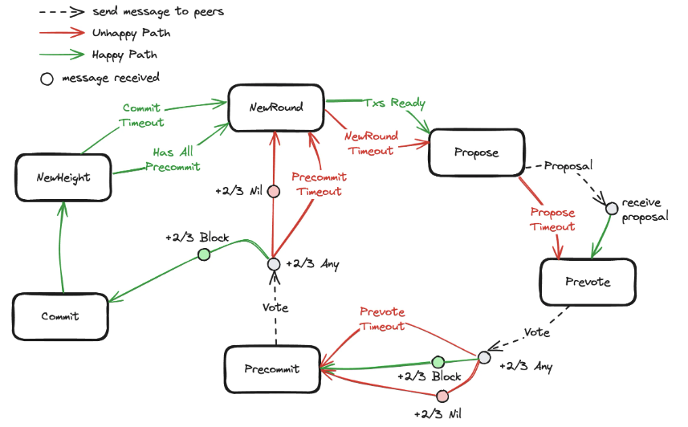

# Tendermint BFT

## Ovweview

Tendermint BFT 在 [PBFT](./pbft.md) 的基础上实现了线性 view change，这是它最大的贡献。同时，Tendermint BFT 不会存在分叉，即出块了就一定是 finalized 的，牺牲了系统的活性（没有免费的午餐）。
Tendermint BFT 本质上与 [PBFT](./pbft.md) 一样也是两轮投票（粗略的流程基本一致除了名词），并且基于之前对 [PBFT](./pbft.md) 或者 [HotStuff](./hotstuff.md) 的介绍和理解，本文直接介绍如何做到线性 view change。在此之后更详细的介绍 Tendermint BFT 的流程（毕竟有标准代码可循），进一步体会 Tendermint BFT 的超时机制（与 [HotStuff](./hotstuff.md) 相比，真是这个超时机制，使其丧失了响应性）。

## View Change

Tendermint BFT 在异常情况下会等待所有节点的 LockQC，来保证新的 proposal 正确性（解决隐藏锁的问题）。等待所有节点的 LockQC 在工程实践中是一个动态调整的超时时间，可能也没有完全收集到。
1. Tendermint BFT 会提交之前的 LockQC 而不是新的提案，所以全网共识（2f+1）的 LockQC 最终会被提交。
2. 如果是没有全网共识的 LockQC（2f+1 个节点没有收到 2f+1 的投票，只有少数节点收到 2f+1 的投票）呢？引入了 Round 的概念，高轮次的提案可以替换低轮次的提案。
3. 另外一个场景就是已经 CommitQC 一定不能被替换，此时一定是全网共识过 LockQC，此时回到第一点，可以保证 CommitQC 最终全网共识。
4. 所以，Round 替换的前提是只少间隔一个轮次，即 R2 不能替换 R1 但是可以替换 R3 可以替换 R1。

在网络极端情况可能长时间不出块，丧失活性。Tendermint BFT 虽然保证出块就一定是 finalized ，但是本质还是多轮共识，安全优先的协议。上述是整体介绍一下 Tendermint BFT 的 view change，并没有过多涉及到细节。

## Tendermint BFT Flow

* View Change 阶段

1. NewHeight -> NewRound 开启新的一轮共识，NewHeight 代表前一轮达成共识。
2. Tendermint BFT 不区分 Happy Path 和 Unhappy Path，统一用一套逻辑，如前所述每轮共识可能包含多个 Round，所以在 NewHeight 节点会等待一段超时时间 CommitTimeout，收集更多的 LockQC(PreCommitVote)。
3. 保证 NewRound 是从上一个 Height 的 CommitTime 结束后的 CommitTimeout 时间开始的。

协议理论上认为，NewRound 一定会收集所有节点的 LockQC（工程实践上，通过 Round 解锁来保证安全性）。

* Propose 阶段

1. NewRound -> Propose：准备新的提案，会带上最高的 LockQC。
2. Propose -> Prevote：leader 将新的提案广播给所有的节点，并设置 ProposeTimeout。
3. 节点收到 Proposal 或者 ProposeTimeout 超时（提交 nil）进入 Prevote 阶段。

这里使用的广播模式（与 PBFT 相同），而不是主从模式（HotStuff 模式）。

* Prevote 阶段（第一轮投票）

1. Prevote -> Precommit：验证并投票，及时不同意也会投 nil 的反对票，不会像其他协议那样不投票。
2. 收集到 +2/3 “任意投票”后开启 PrevoteTimeout 计时。
   1. 收集到 +2/3 的赞成票，Precommit 阶段会投赞成票
   2. 收集到 +2/3 的反对票（nil），Precommit 阶段会投反对票
   3. PrevoteTimeout 超时，Precommit 阶段会投反对票

PrevoteTimeout 计时开始其实就是协议认为 GST 结束（GST介绍见[Partial Synchronization](./partially_synchronization.md)）。

* PreCommit 阶段（第二轮投票）

1. Precommit -> NewHeight：当收集到 +2/3 的“任意投票”后开启 PrecommitTimeout 计时
   1. 收集到 +2/3 的同意票，Commit 本提案，并进入 NewHeight 阶段，本次提案共识成功。
   2. PrecommitTimeout 到时：本 Round 未共识成功，开启一个 NewRound，Height 不变。
   3. 收集到了所有 Validator 的投票：开启一个 NewRound，Height 不变（为收集到 +2/3 的同意票）。此时可能本轮开始的时候没有收集到全部的 LockQC，导致本轮提案有冲突为通过。

CommitTimeout 和 PrecommitTimeout 其实是 view change 的精髓，目的就是一个尽量收集更多的投票，为下一轮成功提案做准备。如果没有发现“隐藏锁”（[HotStuff View Change 活性被破坏的例子](./hotstuff.md#view-change)），Tendermint BFT 就不会达成共识。

也正是这两个超时要求收集所有的 LockQC ，而不是 +2/3 的 LockQC（HotStuff 那种），导致 Tendermint BFT 必须等待一个固定时间而不是网络延时好就可以立刻继续，所以让它丧失了响应性。

注意：可能会说在网络好的时候收集全部节点不必等待超时时间到也可以继续，也能有响应性，其实这里是一个理论性的讨论，想表达的是 Tendermint BFT 并没有 HotStuff 这种响应性那么好。工程实践上肯定是可以这么做但是 +2/3 的 HotStuff 必然优于等待全部的性能，并且理论上认为设置的超时时间就是等待全部 LockQC 的最小值，所以定性的理解一下就可以，在实践中就是等 2/3 优于等全部。

## Summary

Tendermint BFT 特点：
1. 线性 view change，为后续 HotSuff 等系列共识提供了基础。
2. 共识之后不会出现分叉。
3. 响应性不够理想。
4. NewHeight，NewRound 的设计增加了实现复杂度。

## Reference
[从 HotStuff 回看 Tendermint (一)](https://www.xufeisofly.xyz/blog/tendermint)

[从 HotStuff 回看 Tendermint (二)](https://www.xufeisofly.xyz/blog/tendermint2)

[从 HotStuff 回看 Tendermint (三)](https://www.xufeisofly.xyz/blog/tendermint3)

[Tendermint 中的拜占庭共识算法](https://yangzhe.me/2022/08/13/tendermint-bft/)