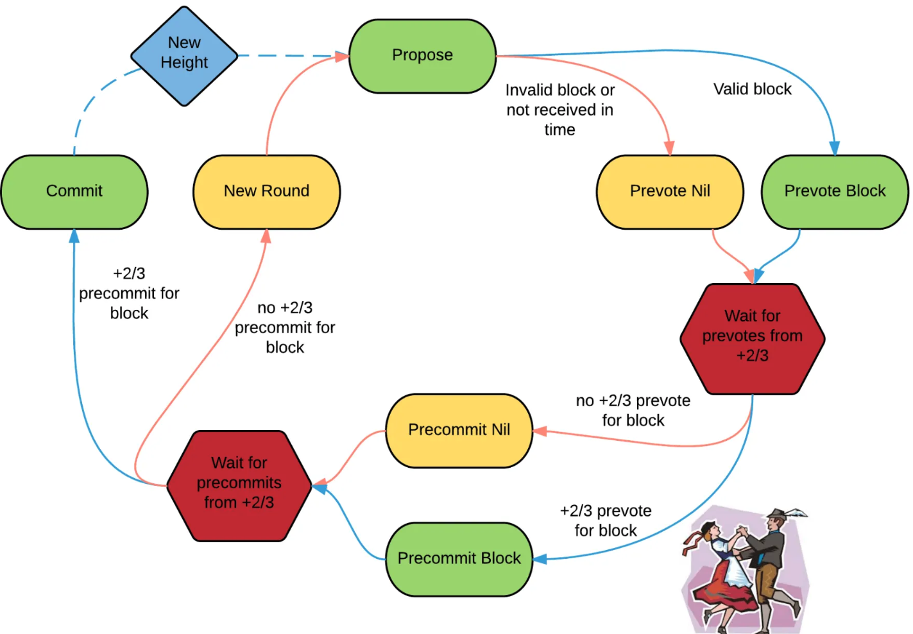

# Tendermint BFT

## 原理

1. Propose
   1. leader 出块并向所有验证者发送 Block X 消息。
2. PreVote
   1. 验证者收到消息后广播 Prevote Block X 消息。
   2. 超时或者block失效（校验失败），此时可以 prevote nil。
   3. 当收到 +2/3 签名的 Prevote 消息之后，
      向其他炎症者发送 Precommit 消息。
   4. **锁定机制（重点）:**
       1. 如果收到 +2/3 签名的 Prevote 消息，此时当前验证者锁定 Block x
         （锁定信息：Block-消息，X-高度，R-轮数），以及 Prevote 证明合组成 PoLC（proof-of-lock-change）。
       2. 如果在 Precommit 阶段没有达成共识，会重复这三个阶段，每次循环都用轮数 r++ 记录。
       3. 如果 Block 被锁定，那么下一轮无论 Proposer（应该会换新的）发布任何 Block Y，当前节点只能 Prevote Block X。
          如果验证者在轮次 R1 被锁定，在轮次 R2 收到了其他块的 PoLC，则它可以在轮次 R3 解锁，R1<R2<R3。
3. PreCommit
    1. 该阶段只能 Precommit 锁定的 Block，此时可能 Precommit nil（PoLC nil 情况下）。
    2. 收到 +2/3 签名的Pprecommit 消息,则 Commit Block X。
    3. 其他情况（未达到共识）维持锁定状态并 Precommit nil。

### 类比 PBFT

Tendermint PBFT 与 PBFT 最主观的区别就是锁定机制，其他的三阶段部分
只是名字不同作用几乎一样。那么我们就看一下这个锁定机制到底改变了什么？
也就知道它俩最大的区别了，锁定机制记录了“要执行的消息，但未执行，且 2/3
达成了共识”，当切换新主的时候，这个记录可以直接用而忽略新主的新提案，不
论切换谁（即使新的主没有锁定这个消息），这个消息都会被 commit。PBFT 
没有锁定机制，所以在切换主的时候需要同步 checkpoint 及其证明集合，Prepared
证明集合等大量消息。所以Tendermint PBFT 与 PBFT 最主观的区别就是提升了
切主的效率。PoS 中主的切换是轮训，并不是 PBFT 超时视域变换（选出最 Prepared 消息最多的新主），
新主很可能就没有前一轮 Prepared 的消息，Tendermint PBFT 应该说更适合 PoS。

Tendermint BFT 的活性更好一点，在安全性得不到保证的时候选择出空块，
PBFT 就会卡住等待超时的视域变换。

Tendermint BFT 的安全新更好一点，2/3 以上作恶节点才能控制 Tendermint BFT，
1/3 到 2/3 作恶节点就已经可以是 PBFT 不出块了。

要清楚的知道，Tendermint BFT 安全性和活性比 PBFT 好实在区块链场景下，
换一个没有类似基于 PoS 的主轮换保证的前提下，Tendermint BFT 是无法运行的。
所以 Tendermint BFT 是针对区块链的一个 PBFT 优化。

最后，说一下锁定机制为什么是两轮以上可以解锁，而不是一轮？
要明白锁定的前提是什么？是 PoLC，即一个消息的证明集合（2/3 以上的共识）
所以应该说是已经确定是集群中 2/3 都接受新的了。
两轮应该就是一个安全保证，注意解锁前一轮的 PoLC 的两次新 PoLC 必须相同。

### 换主

正常情况下就是根据质押进行轮换（这里还会设计 vote power计算），
在异常情况下通过 prevote nil 和 procommit nil 使主流程正常
运行保证 Proposer 进行切换。

Tendermint BFT 在设计之初就是为区块链而设计，所以设计部分就会
直接使用 PoS 的质押，这个于更早期没有结合 PoS 的 PBFT 是不同的。

## Reference
[Tendermint 中的拜占庭共识算法](https://yangzhe.me/2022/08/13/tendermint-bft/)