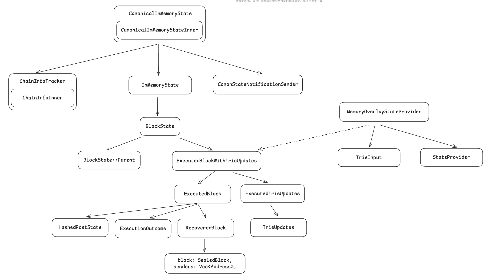

# Chain State

## Overview

Chain State 主要组成有两部分，即内存和DB，内存中会存储所有需要的 Block（可能有fork，会进行清理）。
与磁盘组成一个完整的 chain。有意思的点是，rust 语言的实现（map 迭代器）让内存中的区块可以很简洁的
与DB数据组唱一个 chain。这里面在维护基本的 block 数据以为还会有 chain info 的信息（canonical safe，finalized 等）。
并且 block 数据的组织方式也是与 geth 不同的，这主要跟 reth stage sync 有一定关系。

总之，Chain State 将内存中缓存的 block（分叉，pending等种种情况）与磁盘结合一起组织长了一个chain，并维护了chain的基本信息和基本的事件通知功能。

## Memory

**CanonicalInMemoryState**

首先明确 Canonical 概念，可以理解为执行并验证通过的区块，但是并不一定在主链上，后面有重组的可能性。
与 safe 和 finalized 区块，是有区别的，canonical 被重组的概率最大。

CanonicalInMemoryState 可以简单理解为就是内存中缓存的执行并验证通过的区块，等待着共识协议来从这些区块中取出必要的区块组成主链。

CanonicalInMemoryState 包含三个成员变量：
1. InMemoryState：内存中缓存的区块，包括区块执行的结果和中间结果。
2. ChainInfoTracker：记录 chain 的信息，包括 canonical，safe, finalized 等信息。
3. CanonStateNotificationSender：管道通知器，当有新增或者重组区块的时候会通过它发出通知给订阅器。

提供的方法多数都是针对 InMemoryState 封装的内存区块去数据的增删改查。
**但是有一类方法需要值得注意**，chain(update_chain)类方法，其实其内部是有 chain 这个概念的，
因为内存中的 block 通过 parent 可以组成至少一个chain（考虑分叉），所以通过一个 block 的信息就可以组织成一个 chain（rust语言的 map 迭代器，实现非常简洁，但是本质逻辑就是这样的）。
其次，有 ChainInfoTracker 还可以获取 chain 的基本信息，所以可以在内存中缓存的区块（CanonicalInMemoryState）中组织处 chain 的概念。

**ChainInfoTracker**

维护 chain 的基本信息，包括：last_forkchoice_update， canonical_head_number，canonical_head，safe_block，finalized_block。
有了上述 Canonical 概念的讲解，变量含义也比较好理解，并且方法也是基本的增删改查，故不做过多赘述。

**CanonStateNotificationSender**

底层是基于 tokio_stream 的通知机制，需要实现 Stream trait (poll_next 方法)，不在此过多赘述，暂时知道订阅和发送事件的使用即可。

**InMemoryState**

维护内存中 Canonical 区块数组和 pending 区块， pending 区块比 Canonical 的级别还要低一些，比如正在执行和验证但是没有出结果，
或者矿工挖块之后还没有得到网络确认之前，在或者发生了分叉保存的前一个分叉节点（防止跳转回去，类似 opBNB 中 op-node 里面的 pending 概念）。

其方法都是比较基本的增删改查，唯一值得注意的是 pending 的更新使用了原子性的更新与通知 send_modify，避免了多线程的竞争，让使用变量的结构体立刻看到变化，而不是使用竞争的方式看到变化（加锁）。

**BlockState**

内存（InMemoryState）维护的 Block 信息正式通过 BlockState 体现的，其内部分为两种数据：
1. ExecutedBlock：区块数据，包括区块之前后的输出，以及涉及到 account，storage 叶子节点的 hash 值（与 reth stage sync 有一定关系）。
2. ExecutedTrieUpdates：状态数据，包括状态更新的中间节点

**ExecutedBlock**

内存中维护的区块数据，包括：
1. RecoveredBlock: SealedBlock-验证后的区块，senders-交易发起者，也与 reth 的 stage sync 有一定关系。
2. ExecutionOutcome：bundle，receipts 等执行结果。
3. HashedPostState：accounts 和 storages 的叶子节点的 hash 值。

**ExecutedTrieUpdates**

是一个枚举值，主要是计算 root hash 并记录中间更新的状态数据。

## Memory + DB

**MemoryOverlayStateProvider**

将内存与DB结合起来的一个结构，内部维护的 StateProvider 就是 DB 的抽象。

ExecutedBlockWithTrieUpdates 就是从 CanonicalInMemoryState 根据需要从内存中提取出来的一组区块可以组成一个 chain 与 DB 链接到一起。
提供的方法有很多，基本思路都是内存中操作，然后磁盘操作。

trie_input 比较有意思，他是一个 Lazy-loaded 的 trie 数据，就是 ExecutedBlockWithTrieUpdates 这些区块所有的 trie 数据以及 account 和 storage 的叶子节点的 hash 值，都会被收集在一起。