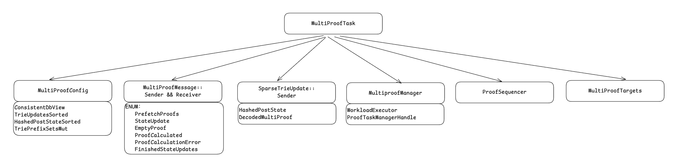

# PayloadProcessor

PayloadProcessor 主要的作用是在区块执行期间，对于状态是数据进行预取并结合叶子节点的更新，然后计算 State Root。
主要分三个任务：
1. PrewarmCacheTask：预执行交易以获取状态访问模式，识别交易会访问哪些账户和存储槽。
2. MultiProofTask：根据 PrewarmCacheTask 访问的叶子节点，生成 Proof。
3. SparseTrieTask：根据 MultiProofTask 生成的证明，计算 State Root。

这三个任务，都使用了线程的并行和异步进行优化，底层都是通过 WorkloadExecutor 完成的调度。

## WorkloadExecutor

WorkloadExecutor 是混合的计算和 IO 密集型任务的调度器。

计算密集型的任务使用的调度器是 RayonPool 线程池，用于 CPU 密集型并行计算，使用了它之后，计算任务会自动话的并发，不需要额外的复杂代码。
它的线程模型是：每个线程有自己的任务队列，空闲线程会从其他线程的队列中"窃取"任务。

IO 密集型的任务使用的是 tokio 运行时，运行时管理的内容相对多一些，这里这关注了线程池（这里的线程池主要是 IO 任务线程），
使用它之后，任务会自动的异步化 + 并行化（多线程）。

WorkloadExecutor 内部是通过 WorkloadExecutorInner 完成了对 tokio 和 RayonPool 的封装。
RayonPool 来自参数，tokio 在内部初始化（解析见代码注释）。
```rust
fn new(rayon_pool: rayon::ThreadPool) -> Self {
    fn get_runtime_handle() -> Handle {
        Handle::try_current().unwrap_or_else(|_| {
            // 全局只执行一次
            static RT: OnceLock<Runtime> = OnceLock::new();

            let rt = RT.get_or_init(|| {
                // 创建一个多线程，并线程保活 15 秒的运行时环境
                // 空闲线程保活 15s，是为了任务复用，避免线程销毁和创建的额外开销
                // 如果 15s 之后仍没有任务，线程会被销毁，但是运行时还在
                // 运行时会创建新的线程，所以运行时在程序生命周期内只创建一次，但是线程可以很多次
                Builder::new_multi_thread()
                    .thread_keep_alive(Duration::from_secs(15))
                    .build()
                    .unwrap()
            });

            rt.handle().clone()
        })
    }

    Self { handle: get_runtime_handle(), rayon_pool: Arc::new(rayon_pool) }
}
```

WorkloadExecutor 是对外暴露的数据结构，其中 `spawn_blocking` 方法值得注意，他是将堵塞任务加入到 tokio 统一的堵塞线程池中，不堵塞当前任务。

**注意：tokio 运行时在程序内不是唯一的，可以是多个，这里是因为需要使用 `OnceLock` 实现了单例。
每个运行时都是独立的，有自己的线程池和事件循环。**

## PrewarmCacheTask

PrewarmCacheTask 的核心功能就是并行的执行 TX (忽略因执行顺序引入的结果不正确)，收集访问到的 Account 和 Storage slot，并发送给下一个任务处理器生成 MultiProofMessage。

```rust
pub(super) struct PrewarmCacheTask<N, P, Evm>
where
    N: NodePrimitives,
    Evm: ConfigureEvm<Primitives = N>,
{
    /// 底层执行 TX 的线程调取器
    executor: WorkloadExecutor,
    /// Block cache
    execution_cache: ExecutionCache,
    /// 待执行的 TX
    pending: VecDeque<Recovered<N::SignedTx>>,
    /// 执行交易的 Ctx，是执行的核心逻辑实现的地方
    ctx: PrewarmContext<N, P, Evm>,
    /// How many transactions should be executed in parallel
    max_concurrency: usize,
    /// Sender to emit evm state outcome messages, if any.
    to_multi_proof: Option<Sender<MultiProofMessage>>,
    /// 接受上层控制 PrewarmCacheTask 开始，停止的管道
    actions_rx: Receiver<PrewarmTaskEvent>,
    /// 上层控制 PrewarmCacheTask 开始，停止的管道
    actions_tx: Sender<PrewarmTaskEvent>,
    /// 正在运行的 task 数量
    prewarm_outcomes_left: usize,
}
```

控制逻辑在 `run` 方法中，实现的具体核心逻辑在 `spawn_all` 方法中。
`spawn_all` 首先根据并发度（默认64）和要是行的 TX 数量计算每个任务需要执行的 TX 数量，
然后调用 `WorkloadExecutor.spawn_blocking` 将堵塞任务异步化，相当于多个任务（每个任务）并行化。

任务的具体执行逻辑在 `PrewarmContext.transact_batch` 中执行，遍历 TX 串行执行，并返回 `ExecResultAndState`
其中重要的成员变量是 `EvmState` ，经过处理之后，即为交易执行期间更新和访问的 Account 和 Storage slot，他会被组装成
`MultiProofMessage.PrefetchProofs(MultiProofTargets)` 发送给下一个任务处理。

## MultiProofTask



MultiProofTask 核心功能是获取状态数据的中间节点并写入 SMT，用于写入下一结算计算 state root。
MultiProofTask 启动地方有两个，一个是来自 PrewarmCacheTask 生成的 MultiProoftargets，
另一个是上层 Block 执行期间访问的叶子节点（账户或者slot）。一个来自预取，一个来自真正的执行（猜测是为了防止执行比预取快的情况）。
当然有过滤逻辑，不会重复读区。

1. MultiProofConfig: 来自上层调用的参数 TrieInput（更新或者读区一个节点，需要 Trie 路径上的节点）成员变量转换而来。在这里相当于一个内存的状态数据库，这个数据库只有需要访问的数据。
2. MultiProofMessage: 是 MultiProofTask 状态机的状态，通过接受不通类型的消息完成整个任务的执行（核心内容后面详细介绍）。
3. SparseTrieUpdate：所有获取的 Proof 的集合，并发送给下一个阶段。
4. MultiproofManager：这里的 Manger 并不是管理所有的 MultiProofTask，而是管理一个 Task 的执行，内部的核心是绑定了 WorkloadExecutor，并根据业务（访问 AccountTrie 或者 StorageTrie）进行了封装。
5. ProofSequencer：保证获取的结果有序的写入到 SparseTrieUpdate。
6. MultiProofTargets：记录了已经完成的叶子节点，用于去重。


MultiProofTask 状态机：
1. PrefetchProofs
   1. 来自 PrewarmCacheTask 管道预取的任务。
   2. 去重（如果叶子节点之前执行过，则跳过），每 10 个叶子节点作为一个任务进行调度。
   3. `multiproof_manager.spawn_or_queue` 底层调用 WorkloadExecutor 并行执行，默认并发度 256。
   4. `spawn_storage_proof` or `spawn_multiproof` 内部使用并行 `ParallelProof::new`（参数就是 MultiProofConfig），执行 `decoded_storage_proof` 生成 Proof。
2. StateUpdate
   1. 来自区块执行的过程中的更新，逻辑同上。
3. FinishedStateUpdates
   1. 区块执行完，上层的 `StateHookSender` (后续介绍)被回收时，会发送这个消息。
   2. 退出状态机循环。
4. EmptyProof
   1. 当预取结束，或者当前任务的叶子节点都已经执行过，此时 `ProofSequencer` 中可能连续的 Proof 了，可以批量取一次给下一个任务了。
   2. 从 `ProofSequencer` 去除连续的 SparseTrieUpdate 并发送通知给下一阶段的任务。
5. ProofCalculated
   1. MultiproofManager 执行完一个任务之后发送这个消息给 MultiProofTask ，推动他执行下一个任务。
   2. `self.multiproof_manager.on_calculation_complete()` 执行逻辑与 PrefetchProofs 和 StateUpdate 差不多，区别是任务来自 pending（因为有并发限制，多余的任务会存储在 pending 中）。
6. ProofCalculationError

## SparseTrieTask

SparseTrieTask 就是接受 MultiProofTask 的结果然后计算 state root，没有什么特别的。
唯一特别的是 SparseTrie 并不是传统意义上的 SMT，它的结构和 MPT 差不多，但是所有不需要的节点都会收缩成 Hash 指针。
有点像是一层包装，与 MPT 概念及户一样，唯一的区别是 Geth 中不会强调不使用的节点必须是 hash 指针（因为缓存的存在，
可能存在部分被展开但是不会当前 Block 计算使用的节点）。
