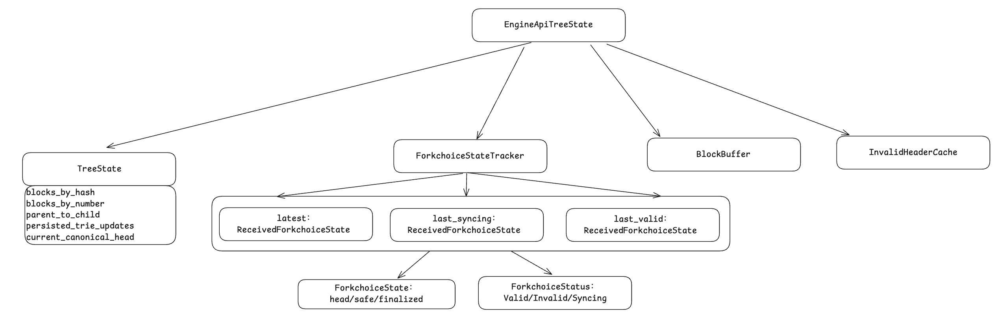

# EngineApiTreeState

## TreeState

TreeState 是 Reth 引擎树的核心状态管理结构，负责维护区块链的完整状态，支持分叉、重组、清理等复杂操作，给共识层提供数据基础。

1. blocks_by_hash：维护已执行区块（包含分叉），必须是正确执行且被验证的区块，`ExecutedBlockWithTrieUpdates` 包含结果和 trie 中间节点。
2. blocks_by_number：维护高度和对应的区块数组。
3. parent_to_child： 维护副区块与子区块的 hash 映射关系。
4. persisted_trie_updates：维护已经落盘但是没有 finalized 的区块，用于回滚。
5. current_canonical_head：维护最新的 canonical 区块头。

提供的方法也是根据上层传入的参数更新这几个变量，或者获取（部分方法需要保证变量之间的一致性），没有什么特别值得介绍的。

## ForkchoiceStateTracker

跟踪 forkchoice（来自共识层的状态更新请求） 更新的状态。
1. latest：记录最新接收状态
2. last_syncing：记录需要同步的 point。
3. last_valid：记录最新的有效状态。

last_syncing 需要说一下，它涉及到 EngineAPI，当 forkchoice 更新一个本地没有的状态，需要执行层通过 P2P 进行同步。

上述三个变量的转化流程：
1. 共识层发送 forkchoice 更新
2. 执行更新 latest = Some(new_state)，并结合本地数据验证状态有效性
3. 如果有效，开始同步 last_syncing = Some(new_state) 
4. 同步完成，last_valid = Some(new_state)，last_syncing = None

## BlockBuffer

缓存 pending block，因为 parent 还没有接收到，先在本地缓存后续的区块，避免浪费网络资源。

## InvalidHeaderCache

记录验证无效的区块数据，在正式验证之前会进行检查，避免无效运算浪费资源。