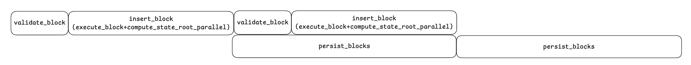

# EngineApiTreeHandler

EngineApiTreeHandler 在 Reth 中作为中间层与共识层通过 EngineAPI 交互完成 CL 与 EL 的共识与执行相关的交互逻辑。
同时，内存中维护所有的区块数据和状态数据，管理 EngineTree（forks），并根据区块的共识规则将数据持久化道存储层。
最后，还会与 P2P 交互协调和控制各种同步区块的模式（StageSync，NewBlock，Checkpoint）。

## Member

1. [EngineApiTreeState](./2_engine_api_tree_state.md)：引擎树的状态管理（包含已执行区块、缓冲区块、无效头部缓存等），维护区块链树的完整状态。
2. [CanonicalInMemoryState](../1_crate_chain_state.md)：管理 Canonical Chain，用于外部的 RPC 请求。 
3. incoming_tx，incoming：EngineApiRequest 的发送端和接收端，处理引擎 API 请求和响应。
4. outgoing（EngineApiEvent）：向外部发送 Engine 事件的通道，通知外部 Engine 状态的变化。
5. PersistenceHandle：存储服务的抽象，EngineApiTreeHandler 作为前台通过管道消息异步与存储服务交互，提升性能。
6. PersistenceState：跟踪持久化的进度和接受存储服务的回调消息。
7. [PayloadProcessor](./1_payload_processor.md)：对于状态是数据进行预取并结合叶子节点的更新，并行计算 State Root。

## Control

engine API handler loop
1. try_recv_engine_message
   1. 监听 incoming（EngineApiRequest）的消息。
   2. 如果 PersistenceState（正在写盘），监听带有超时（500ms），防止因监听堵塞磁盘的操作。
2. on_engine_message
   处理监听到的来自共识层的消息或者事件，主要分为三类：
   StageSync 控制类的事件（来自 Reth 上层的协调器模块-ChainOrchestrator）
   EngineAPI 类的请求（来自共识层）
   从P2P网络同步区块的控制类请求。

   1. FromEngine::Event
      1. BackfillSyncStarted：更新 EngineApiTreeHandler::backfill_sync_state 状态为 Active。
      2. BackfillSyncFinished
         1. 结束的消息是一个 ControlFlow 的枚举，分三种情况：Unwind，Continue（有进展），NoProgress（无进展）
         2. 如果是 Unwind，需要记录 bad_block 到 invalid_headers（避免后面无效的计算）。
         3. EngineApiTreeState 和 CanonicalInMemoryState 内存 Block 根据同步的进度进行规整操作。
         4. backfill_sync_target：检查同步的最新点与 chain 目前的 finalized block 的距离，判断是否新的一轮 backfill，最新点与 finalized 的距离需要超过闸值（目前比较大五大达到，所以基本就是一轮 backfill）。
         5. try_connect_buffered_blocks：从 EngineApiTreeState 缓存的不连续的 block 找到，当前同步点往后的block，进行 `insert_block` 和 `make_canonical`。

      backfill_sync_state 状态转换：Idle（空闲）, Pending（已经计划，但未开始）, Active（正在进行中）。
      当 ChainOrchestrator 开始调度 Backfill 的时候会发送 Start(target_block) 事件，从 Idle 变成 Pending。
      同时，ChainOrchestrator 会调用 pipeline 做一些准备工作，之后会发送 BackfillSyncStarted 事件，从 Pending 变成 Active。
      最后，执行完收到 BackfillSyncFinished，从 Active 变成 Idle。

   2. FromEngine::Request
      1. InsertExecutedBlock
         1. 对于 L1 来说，本地挖矿的时候，会将执行结果附加在 block 上发送给 EngineApiTreeHandler 缓存，避免重复计算（一种优化策略）。
      2. Beacon
         1. ForkchoiceUpdated
            1. on_forkchoice_updated：[EngineApiTreeState](./2_engine_api_tree_state.md) 和 [CanonicalInMemoryState](../1_crate_chain_state.md) 内存 block 数据的更新与清理。
            2. 成功之后，更新 [EngineApiTreeState.ForkchoiceStateTracker](./2_engine_api_tree_state.md#forkchoicestatetracker)
         2. NewPayload
            1. on_new_payload(后续介绍)
   3. FromEngine::DownloadedBlocks
      当从 downloader 收到区块的时候 EngineApiTreeHandler 会收到 DownloadedBlocks 。
      多数都是因为 chain 不连续，最新状态的更新，在流程中会触发 downloader 现在新的区块。
      1. on_downloaded
         1. 限制单次处理的区块数量（默认4个），多余的会通过 DownloadedBlocks 发送会主循环。
         2. 遍历要处理的 block，执行 on_downloaded_block
            1. insert_block(后续介绍)
               1. try_connect_buffered_blocks：如果插入成功，从缓存的区块中找后续区块插入。
               2. on_disconnected_downloaded_block：如果插入失败，如果是 chain 不连续，从 P2P 网络下载区块。
3. advance_persistence
   住循环在处理完来自共识层的消息或者事件之后，进行持久化，并不是在 Block 执行和验证之后立刻执行。
   advance_persistence 是执行和验证之后的持久化部分，其内部主要是一些校验检查，真正的写是一步的 persist_blocks。
   所以，execute + validate 与 commit 组成了一个 pipeline 的形式。

   这里在正式介绍之前需要简单的说一下 persistence_state 的原理，它的主要功能就是跟踪存储服务的情况，比如正在什么操作，持久化进度等。
   1. self.persistence_state.in_progress()，如果正在持久化
      1. 非堵塞式的查看一下是否在持久化中（try_recv()），如果还没有完成，返回 Empty ，则不进行本轮持久化。
      2. 如果持久化完成，返回 hash 和 number，此时 persistence_state.finish(记录 last_persisted_block，并关闭与存储服务的管道)
      3. on_new_persisted_block
         1. find_disk_reorg + remove_blocks，找到 reorg 的 block 并在持久化的服务中删除 reorg 数据。
         2. [EngineApiTreeState](./2_engine_api_tree_state.md) 和 [CanonicalInMemoryState](../1_crate_chain_state.md) 清理落盘之前的数据
   2. 如果没有在持久化
      1. find_disk_reorg + remove_blocks （同上）
      2. should_persist：没有进行 backfill_sync 并且 last_persisted_block - canonical_block_number > persistence_threshold(defaut 2)
         只保留 2个太少了，持久化了的区块不会在内存中立刻删除。
         1. persist_blocks(get_canonical_blocks_to_persist)
            1. get_canonical_blocks_to_persist
            2. 返回 `(last_persisted_number .. canonical_head - threshold(default 2)]`，对于那些未计算 trie 更新的区块，运行状态根，并保存 trie 更新。
            3. PersistenceHandle.save_blocks 向存储服务发送异步消息
            4.  self.persistence_state.start_save， 更新 persistence_state 状态

## Workflow

### on_new_payload

主要是来自 EngineAPI 的 NewPayload 请求，会执行 on_new_payload 回调。

1. `payload_validator.ensure_well_formed_payload`，验证 payload 不违反共识规则。
2. 通过 outgoing 向外部发送区块接受事件 `BeaconConsensusEngineEvent::BlockReceived`
3. 根据 block 从[BlockBuffer-缓存 future blocks](./2_engine_api_tree_state.md#blockbuffer)取出最久远的未上链的 ancestor，检查是否是之前计算过的无效block（避免无效计算）。
4. 如果正在进行 StageSync，将 Block 插入 [BlockBuffer-缓存 future blocks](./2_engine_api_tree_state.md#blockbuffer) 作为future blocks。
5. 如果正没有在进行 StageSync，调用 insert_block -> insert_block_inner(核心逻辑)
   1. 在 [TreeState](./2_engine_api_tree_state.md#treestate) 是否有已经存在 block（之前是否执行过）。
   2. validate_block：共识层 validate block header/block
   3. state_provider_builder：根据 block.parent_hash 获取状态数据的 provider。
   4. 获取 parent_block，并通过共识层验证 block 和 parent_block 的正确性。
   5. 并行计算选择的逻辑
      1. persisting 检查，没有在持久化，或者没有持久化当前区块的后代（只能是祖先）
      2. 并且没有配置 state_root_fallback （强制串行计算，测试比对使用）
      3. 并且配置了 use_state_root_task ，配置了使用并行计算，并且并行资源足够
      4. ancestors 没有 missing_trie_updates
      5. **以上满足，就可以并行，但是是否可以后台并行，还需要下面的判断**
      6. compute_trie_input，收集父区块的 叶子节点和中间节点，如果这个前缀集合为空，则可以后台并行计算，否则只是开启 prewarming（空块等状态没有变更的情况，比较少见）。
   6. execute_block：执行区块交易，有预编译合约缓存优化，开启 prewarming 等优化。
   7. 计算 state root
      1. 如果可以（5中的策略）并行，执行前端并行或者后台并行（也是 5 中就确定）
      2. 否则就是串行。
      3. 或者并行计算之后检验失败也会回退到串行。
   8. 如果 state root 校验失败，on_invalid_block 将block缓存到无效cache中，用于后面去重。
   9. 结束 prewarming task （execute_block 阶段有启动）
   10. 在 state root 计算过程中会记录 trie_updates，然后和 block 组合成 `ExecutedBlockWithTrieUpdates`，用它更新 [EngineApiTreeState](./2_engine_api_tree_state.md) 和 [CanonicalInMemoryState](../1_crate_chain_state.md)。
6. 当前 Block 是有效的并且是同步的目标点，发送 `TreeAction::MakeCanonical` 事件，EngineApiTreeHandler 也会监听到这个事件并执行 make_canonical（后续介绍）

### validate_block

validate_block：共识层 validate block header/block
在执行前和插入 [BlockBuffer-缓存 future blocks](./2_engine_api_tree_state.md#blockbuffer) 之前都需要被调用

### execute_block

执行区块交易，有预编译合约缓存优化，开启 prewarming 等优化。

### insert_block

如上所述，主要完成区块的执行和校验。主要在以下时刻被调用：
1. 新有效载荷处理时：当通过 Engine API 接收到新的有效载荷，且 Backfill 状态为空闲时
2. 区块下载完成时：当区块下载器完成区块下载，且 Backfill 状态为空闲时
3. 缓冲区块连接时：当尝试连接之前缓冲的区块时

### make_canonical

1. on_new_head：[EngineApiTreeState](./2_engine_api_tree_state.md) 的校验和更新
2. on_canonical_chain_update：[CanonicalInMemoryState](../1_crate_chain_state.md) 的校验和更新

主要在以下时刻被调用：
1. 新有效载荷处理时：当通过 Engine API 接收到新的有效载荷，且该区块是同步目标头时
2. 区块下载完成时：当区块下载器完成区块下载，且该区块是同步目标头时
3. 缓冲区块连接时：当成功连接缓冲的区块，且该区块是同步目标头时

1. Did:
   1.1 Geth download block intervsl adjust.
   1.2 Geth and Reth compare metrics configed.
   1.3 Reth crates（engine) detailed and docmented, 80%.
      Chain Controller(Engine Tree):https://app.clickup.com/25652588/v/dc/revbc-40897/revbc-299697
      Prewarm:https://app.clickup.com/25652588/v/dc/revbc-40897/revbc-299677
      Chain State Manager: https://app.clickup.com/25652588/v/dc/revbc-40897/revbc-299657
      Storage and Event doing.
   1.4 Follow up incremental snapshot process, handle chainIndexer issue and summary bugs to set priority.
2. Blocking:  N/A
3. Plan:
   3.1 Follow Reth VS. Geth test.
   3.2 Continue tidy reth crates, focus on Storage for prepare to replace statedb by geth's.
   3.3 Research Geth's statedb in rust.