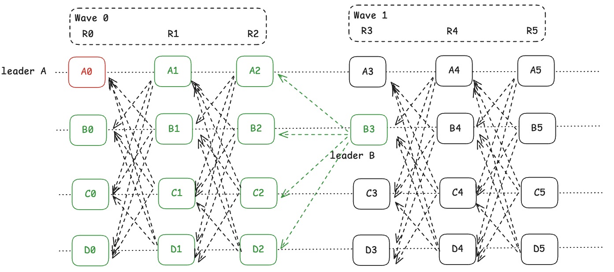

# Sui Consensus: Mysticeti

## Overview

Mysticeti 是一个基于 DAG 的拜占庭容错共识协议，专门设计用于达到延迟的理论下界（与之前的 Narwhal/Tusk 对比）。

Mysticeti 本质上也是基于拜占庭假设的两轮投票确认一个共识内容，特别点在于投票的方式不再是之前[BFT 类共识](../../consensus/)的显示投票（LockQC,CommitQC），而是基于 DAG 的隐式投票（DAG 在这里可以理解为传统意义的 Block 中部分交易的顺序，后续介绍），通过隐式投票建立的 DAG 依赖关系图达成全局视图一致，最终确认了消息的顺序。

### Double Transmission

基于 DAG 共识的被设计的初衷其实是为了解决 double transmission 问题，对于传统的 Mempool 交易池，一个交易被客户端发送给 Validator 后会通过 Gossip 的方式传播给其他 Validators，而共识提案中又会打包一遍这些交易，从而重复占用了带宽，这称为 double transmission 问题。根本原因是即使 Mempool 已经完成了交易内容的同步，仍需要对交易顺序进行协商。解决它的思路也很简单：**在 Mempool 传播交易内容时顺便完成对这批交易顺序的协商**。

所以，Mysticeti 的 Mempool 不是全局的，而是局部的，在共识的投票轮次中都带有当前节点局部交易及其顺序（子 DAG），通过 BFT 共识的两轮投票锁定并提交期间产生的全部子 DAG，在对所有的子 DAG 进行线性化（全局统一的规则保证输入的子 DAG 相同情况下，输出的交易顺序相同），然后再执行。

至此，可以得到 Mysticeti 的两个基础：
1. Mempool 是局部的，每个节点的交易池的交易不是统一的。
2. Mysticeti 共识的内容是交易的顺序，并不包含执行，共识与执行分离。

优点不言自明--提高吞吐。每轮消息都会为最终的交易数量和顺序作贡献（子 DAG），并且不需要等待执行完验证通过再投票即可发起投票。

### Multi-chain Parallel

局部 Mempool ，使得每一个节点都需要将本地交易打包进最终的区块，投票过程中每轮附带的 DAG 消息正式这个作用，但是换一个角度相当于每个节点都在一个产生新的区块（子 DAG）,像是多个 chain 并行出块。但是这只是像，并不是因为多个 chain 最终的数据必须是确定且唯一的，就是每一个节点需要知道所有的 chain 的状态。

它的好处是使得那个节点都没有空闲等待的时候，也会提升吞吐，传统的 BFT 类共识，在leader出块期间其他节点多数时间都是在等待。

## WorkFlow

Sui Mysticeti 在实现上用 Wave 结构来记录一轮共识，它简化了实现并且可读性强，Wave 见决策独立可以很好的支持 pipeline，默认情况下一个 Wave 有3轮网络交互（论文证明是最少的网络交互次数，这也是它的介绍中提到的延迟理论下界的原因，注意是网络交互的次数最低不能少于3次，并不是 BFT 类共识协议中投票的轮次）。示意图中展示了两轮共识，所以有两个 Wave 结构，并且为了方便讨论，我们先假设网络情况良好，每个节点产生的子 DAG (有的地方也称作共识区块，但是子 DAG 可能能好理解，后面都会称作子 DAG,即示意图中 A0...D2...)。

Mysticeti 采用的网络模型是广播模型，而非 HotStuff 的主从是网络模型，即每个节点产生的子 DAG 会点对点广播给每一个节点，要求每个轮次超时时间（生产环境 50ms）收到最后多的子 DAG，否则尝试提议新的区块，如果再超时（生产环境 200ms）强制提交新的区块。

有了前面基础的介绍，接下来看一下 Mysticeti 的共识流程，为了方便讨论我们一 Wave 1 为基础进行介绍。

* Round 3: Leader Round
    1. 明确 leader（B）：所有节点根据相同的规则，可以明确当前 wave 的 leader 是谁。
    2. 提议区块并广播，所有的节点都会提议区块，不会等待 leader 的 B3，但是所有节点开始提议区块的前提是需要钱一个 Wave 0 的结束，即 leader A0 的确认。 
    3. 提议的区块会包含其看到的祖先，在这里是 [A0..D2]
    
    注意：
    1. leader 的轮换可以与 Stake，声誉（之前是否被 slash 等评分）决策，不属于共识协议的一部分。 但是，确定性的 leader 确实很重要的，因为在 Decision Round 都是基于 leader 的视角确定最终的共识结果。
    2. 这里的区块其实就是子 DAG，签名之后直接广播，无须等待其他节点验证并收集 2f+1 的签名。

* Round 4: Voting Round
    1. 验证者对领导者区块进行隐式投票并广播，投票的方式就是打包新的子 DAG，并且带有他看的祖先，在这里是 [A3, B3, C3, D3]，如果赞成 leader 其祖先里包括 B3，否则不包括，体现出了**赞成和反对**。

    注意：
    1. 投票带有了新的子 DAG，而不是传统 BFT 类共识的赞成反对投票，并且投票带有的新的子 DAG 最后也可能成为共识的结果（后续介绍），是的网络利用率更高（减少轮次，附带信息更多）。这也是“隐式”投票的来源。

* Round 5: Decision Round
    1. 决定是否提交领导者区块，收集 R4 的投票结果：
        1. 收到 2f+1 赞成（引用了 B3）直接提交。
        2. 收到 2f+1 反对(没有引用 B3)直接跳过。
        3. 即没有 2f+1 赞成，也没有 2f+1 反对，处于Undecided 状态（间接投票，后续介绍）。
    
    注意：
    1. 2f+1 的赞成与反对针对的是否引用了 B3，即当前轮次 leader 在第一轮的提议区块，表示2/3节点对于 B3 以及 B3 看到的祖先的认可，所以**当前轮次结束共识确认的是 [A0...D2,B3] 上一个轮次的结果，而不是[A3..A5, B4..D5]当前轮子的子 DAG**。
    2. 由于 A0 在前一个轮次 Wave 0 被确认了，当前轮次 Wave 1 其实是不包含 A0，即上一轮出了 A0 之外其他的子 DAG 以及 B3 才是本轮共识的结果。

上述是一轮标准的 Mysticeti 共识过程，但是还有很多问题值得讨论。

### Leader Purpose

上述介绍的协议过程是理想情况下，即每个节点都能看到全局状态（所有的子 DAG），初看起来 leader 好像没什么用。其实上述第三轮收集投票形成共识已经有所介绍，共识的结果是 B3，对 B3 的认可就是对 B3 看到的历史（或者是祖先 DAG）的认可，所以提交的内容是 B3 视角下看到的祖先，如果网络不理想或者有 f 个恶意节点不给 B3 发送投票，B3 可能看不到全部的祖先，此时其他节点与 B3 的视角可能是不同的。所以共识的结果就是让全局节点看到并认可 B3 的视角，这样可以保证共识的全部子 DAG 是一致的。

### Different View

在实际运行中，每个节点看到的子 DAG 很有可能是不一样的（网络延迟，分区，恶意节点），最终是怎么达成视图共识（得到相同的全局 DAG图）的呢？

1. 每轮消息的发送附带的子 DAG 其实不仅仅包含交易执行的顺序还会有交易本身，因为每个节点都是局部 Mempool，交易正式附带在这些有共识意义的消息里面顺便完成全网的同步（消息与交易一起传递）。
2. 当一个节点收到消息之后没有相应的子 DAG，会启动同步机制主动获取数据。
3. 子 DAG 的构建其实是很快的，因为不想传统的共识需要尽量打包多的交易，每个子 DAG 可以打包少量交易，多个节点在多轮消息中可以组成最终大的 DAG，所以没有必要一次打包过多的诉求。
4. 对于 Undecided 状态的轮次，可能有的节点收到了足够多的投票，有的节点没有，“隐式”投票具备传递性，即 B3 处于 Undecided 状态，但是 C6 被共识了但是引用了 B3 其实 B3 也相当于被共识了--**间接投票**。

### Linearizer DAG

当 B3 达成共识之后[A1...D2, B3] 形成了全局的 DAG，但是子 DAG 之间如何排序？子 DAG 之间内部的交易有冲突怎么办？在 sui 的实现中使用了线性化 DAG，保证数据相同的子 DAG，输出相同的 tx 顺序。基本的排序规则先 Round，再 AuthorityIndex，即 低轮次的 DAG 优先处理，相同轮次根据 AuthorityIndex 进行排序，后面的交易于前面的交易冲突，舍弃后面的交易。Authority 排序是通过链上合约保证全局一致，通过链上治理保证节点不做恶并鼓励头正确的票（正确不是赞成哦！）。

### Two or One Rounds of Voting

上述协议的介绍虽然有三轮网络交互但是只完成了一轮的投票，那么 Mysticeti 是一轮投票？这与 BFT 类共识的安全性相矛盾（BFT 容错至少需要两轮投票，LockQC， CommitQC[这里](../../consensus/pbft.md)）。其实当前轮次共识的结果是 leader 看到的上一轮次视图这一点已经可以得出，其本质是两轮投票。

为了更好的理解，简化一下模型，A0 打包区块，所有的网络消息不附带子 DAG，Wave 1 结束 A0 完成了一轮投票，Wave 2 完成了 B3 的一轮投票，B3 共识的结果其实是 A0 打包的结果（B3视角的祖先）即 A0 第二轮投票完成，B3 第一轮完成。所以本质上还是两轮邮票，依然是 BFT 类共识，只是为了增加吞吐量和网络效率，附带了子 DAG 以及直接和间接的“隐式”投票。

如果是两轮投票那么 LockQC 即上述中的 B3 在收集到 2f + 1 的投票之后可能被 revert 吗？B3 以及他的视图下的[A1...D2，B3]不会，以内在 Wave 1 中 B3 其实完成了两轮投票，但是 Wave 1 期间有一场，A0 只完成一轮投票，是可能被 revert 的，因为 wave 1 一场都没有收集到 2f+1 其实 A0 的两轮投票没有完成，存在两种情况，A0 确实获得了 2f+1 赞成，此时间接投票规则可以保证 A0 被确认，A0 收到了  2f+1 反对，会进行切换 leader 知道达成新的 2f+1 多数认可。 

### Safety, Liveness and Responsiveness

如上所述，依然是 BFT 类的两轮共识，其安全性等效于 BFT 类共识，不在此赘述。

间接投票和超时机制在协议设计层面和工程实践层面保证了共识的活性。间接投票上述已经介绍过（表现为块高在增长，但是 finalized block 没动）。

下面介绍一下超时机制，每轮开始的时候有两个超时，即 50ms, 200ms（下面的讨论以示意图为例）。
1. 当第一个超时 50ms 到达时，会判断是否可以提交区块
    1. R3，R4 需要确认，是否存在前一轮的 leader 结果（A0,和 B3）。
    2. 如果有此时基于看到的前一轮子 DAG 提议当前节点当前轮次的子 DAG。
    3. 如果 leader 结果（B3）提前达到不会立刻提议，尽量等更多，如果全部达到会立刻提议。
    4. 对于 R5 不会要求等到 leader 结果，只是尽可能多收集就好，因为到 R5 的时候，其实已经看到 B3 了。
2. 当第二个超时 200ms 到达时，会强制提新的子 DAG，不会检查结果，但是至少需要一个前一轮的子 DAG 作为祖先（自己的也可以）。如果在 50ms 和 200ms 之间等到了前一轮 leader 结果，会立刻提议。
    1. 强制提议，就是保证活性，提议不代表共识，后面还会根据是否有 2f+1 赞成的投票结果决定是否提交，只是为了不堵塞。
3. 不会重复提交，不会在 50ms,200ms 提交两次，前面提交了后面不会提交。

注意：
1. 满足条件就会立刻提议不会强制等到 50ms 或者 200ms 的超时再进行提议，所以可以满足向影性（特别是第一轮等待前面 Wave 的leader 结果就可以继续）。唯一要说的是 50ms，如果 50ms 之内收集到全部的子 DAG 直接继续，到了之后如果只收集到 leader 结果就会继续（200ms 是有祖先就继续），在等待和尽量收集之间的权衡。 
2. 任何情况下节点都会继续提议区块，只是未必会达成共识（提议了但是可能没有得到多数认可），此时在当前 Wave 轮次可以直接跳过，在后续 Wave 轮次中通过间接投票可以确认唯一的共识DAG结果（间接投票），所以**没有任何 view change 的开销**，或者说没有一场情况下的 view change，只需要按着计划轮换就好了。
3. **每一轮等待必要的结果（前两轮等leader的结果）就可以，其他的子 DAG 尽量等没有也没关系**，都是属于附加的不带上只是最后的共识的交易少一些。

### Pipeline

Wave 结构的设计使得 Pipeline 的实现更加的清晰简单，首先明确 [R0...R5...] 组成的 DAG 视图是全局的每个节点都应该看到，Wave 是建立在这个全局 DAG 的逻辑视图。比如：
1. Wave 0 [R0, R1, R2]
2. Wave 1 [R1, R2, R3]
2. Wave 2 [R2, R3, R4]

当 Wave 1 的决策轮 R3 的时候，它能看到前一个 Wave 0 的全部视图 [R0, R1, R2]，可以轻松完成 pipeline。

## Summary

Mysticeti 在基于 DAG-Base BFT 共识的基础上，同一些关键的洞察使得吞吐量，活性，实现复杂度都得到一定的改善，这些洞察主要包括：

1. 区块可以不用多个节点认证才被使用，只需要签名即可被引用。通过 DAG 的因果关系验证，2f+1 引用 = 2f+1 验证，无需额外的认证轮次和信息。
2. 隐式投票，引用领导者，即表示赞成，不引用表示反对。
3. 决策可以是间接的，通过后续领导者推断（活性，减少 view change 复杂度）。

## Reference

[Mysticeti: Reaching the Latency Limits with
Uncertified DAGs](https://arxiv.org/pdf/2310.14821)

[Sui Source Code](https://github.com/MystenLabs/sui.git)