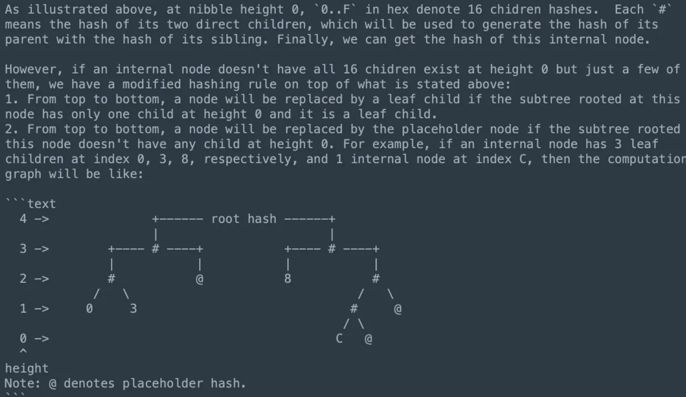
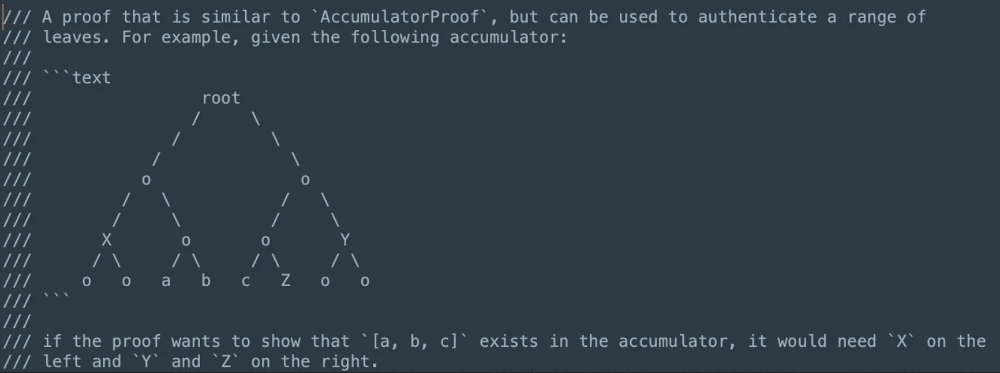

# JMT

## 数据结构
SMT 是 JMT 的基础，或者说 JMT 是 SMT 结合 Diem 的业务场景的定制化。主要做了一下几部分的优化：
1. 全局的空节点或者空子树使用一个特定的 hash 来替代，不需要像 SMT 根据层数来查表。
2. NodeKey = version + nibblePath。
3. 去除 extensionNode，即压缩节点。

## Hash 计算
Hash 计算用特定值来替换查表的方法是不会影响 hash 的准确性，性能上会有小幅度的提升，这部分我的感觉主要还是考虑代码会更简洁。但是，内部节点计算还是会拆开进行计算

_注意：这种 hash 的计算方式是与 MPT 区别的本质所在。_

如果不进行拆分计算 hash，而是把 InernalNode 作为整体计算 hash，这种方式与 MPT 是一样的，但是体现不出 SMT 中全量空间的概念，即一颗 SMT 应该是满二叉树，这里唯一的优化点是没有通过查表发获取每个空间所在层的 hash，而是空子树的 hash 统一用 placeholder 替代。否则无法支持不存在证明。

## NodeKey
NodeKey = version + nibblePath，是存储在 rocksdb 的 key，在内存中 JMT 的 key 是 nibblePath，nibble 是半字节，即 4 bit 用一个 16进制表示一个最小的单元。编码方式如下两个优点：
1. 针对 RocksDB version + nibble 天然有序，没有 compation 的过程，充分利用磁盘空间，以及没有写放大。
2. 根据 Diem 给的数据 256 bit 用户 key ，10亿的用户空间，平均高度是 8 （即 4 Byte），NodeKey 的平均大小 12 Byte。

__注意：上述给的都是平均值，但是叶子节点仍然是 8 Byte（version） + 32 Byte（key），只不过中间节点比较小，平均下来是 12 Byte。相对 MPT 来说，每个 key 都是 32Byte，因为所有的 key 都是 hash 值。__

JMT 内部的节点只有两种类型，InternalNode 和 LeafNode。InternalNode 类比 MPT 中的 BranchNode 即一个 InternalNode 只代表一个 nibble。在 JMT 中没有 ExtensionNode，即压缩节点，主要考虑有一下两点：
1. 随着数据量的增加，ExtensionNode 会越来越少，起到压缩的效果也越来越差。
2. 同时，引入了实现的复杂度，容易引入 bug。

以 BSC 为例，1.78亿 trie node，其中 ExtionNode 仅有 64w，占比 3.5%。所以，当插入时遇到了相同前缀的两个 LeafNode，则前缀进行扩展为 InternalNode。

不同 version 间组成的多棵树像是海蜇一样，也是 JellyFish 得名的由来。

下面看一下其实现

```rust
pub struct NodeKey {
    // The version at which the node is created.
    version: Version,
    // The nibble path this node represents in the tree.
    nibble_path: NibblePath,
}

pub struct InternalNode {
    // Up to 16 children.
    children: Children,
}

pub(crate) type Children = HashMap<Nibble, Child>;

pub struct Child {
    // The hash value of this child node.
    pub hash: HashValue,
    // `version`, the `nibble_path` of the ['NodeKey`] of this [`InternalNode`] the child belongs
    // to and the child's index constitute the [`NodeKey`] to uniquely identify this child node
    // from the storage. Used by `[`NodeKey::gen_child_node_key`].
    pub version: Version,
    // Whether the child is a leaf node.
    pub is_leaf: bool,
}
```

## Proof
JMT 支持存在和不存在证明，不存在证明是之前 SMT 简单介绍过，但是在 RPC 实现上是有一些不同的，下面看一下，在介绍流程之前看一下相关的数据结构。

```rust
pub struct SparseMerkleLeafNode {
    key: HashValue,
    value_hash: HashValue,
}

pub struct SparseMerkleProof<V> {
    /// This proof can be used to authenticate whether a given leaf exists in the tree or not.
    ///     - If this is `Some(leaf_node)`
    ///         - If `leaf_node.key` equals requested key, this is an inclusion proof and
    ///           `leaf_node.value_hash` equals the hash of the corresponding account blob.
    ///         - Otherwise this is a non-inclusion proof. `leaf_node.key` is the only key
    ///           that exists in the subtree and `leaf_node.value_hash` equals the hash of the
    ///           corresponding account blob.
    ///     - If this is `None`, this is also a non-inclusion proof which indicates the subtree is
    ///       empty.
    leaf: Option<SparseMerkleLeafNode>,

    /// All siblings in this proof, including the default ones. Siblings are ordered from the bottom
    /// level to the root level.
    siblings: Vec<HashValue>,

    phantom: PhantomData<V>,
}
```

JMT 还支持范围证明，验证连续的叶子节点存在。


## Question
version + nibblePath 作为 NodeKey，root 只有 version，所以对于支持分叉的链是不支持的。

如果是 version + hash，又违背了 version + nibblePath 的格式，又会导致 rocksdb 存储不是连续的问题（因为 hash 总是随机的不是有序的）。

如果支持在线修剪（删除指定 version 之前的数据）是不会又有 compaction 的问题，因为 rocksdb 按 version 连续。