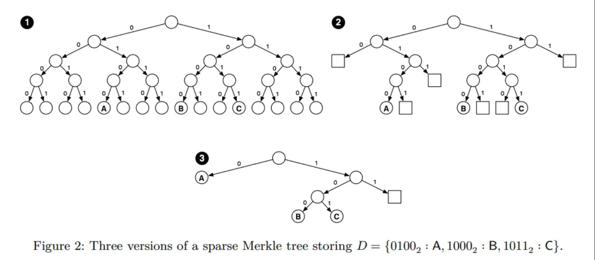

# SMT

## 数据结构
Sparse Merkel Tree 是一个满二叉树，以账户模型为例，SMT 是一个 256 层的满二叉树，每个账户都是存储在叶子节点，对于叶子节点不存储账户，即当前账户 ID 还没有分配的场景使用空（或者特殊值）代替。

SMT 与 MPT 类比最大的优点有两个：
1. 提供不存在证明
2. 更适合空间固定的map，MPT 相对来说更适合空间变化的数组（体现在交易树上）。

在 BlockChain 中存在与不存在证明都不是简单的发送一个 RPC 请求返回 true or false 就可以解决的，因为 BlockChain 是去中心化的，存在恶意节点，所以单纯的 true or false 是不可信的。下面介绍一下在 BlockChain 中存在与不存在证明的模型：
1. client（lightnode） 发送一个 RPC 请求附带需要验证的消息。
2. server（fullnode） 返回一组 hash 值。
3. client 根据这组 hash 值能够计算出需要验证的信息是存在还是不存在。

这个模型有如下两个背景：
1. client 是一个 lightnode 保存了BlockHeader（包含block 的 rootHash）。
2. hash 的鲁棒性决定了伪造一组 hash ，然后利用这组 hash 验证出相同的结果是不可能做到的。
server 返回一组hash就是账户（带验证信息所属的账户）在 SMT 上路径的兄弟节点的 hash 值，client 通过它们可以计算出 rootHash 与本地的 rootHash 比对，如果一致则说明 server 可信（严格的说需要保证与最新的 Block 有一定距离，防止回滚），则证明有效。

针对 MPT 证明存在很容易，但是证明不存在是一件很难做的事情（这是 SMT 引入的主要原因），因为如果不存在怎么返回这一组 hash 来验证server不是恶意节点呢？

在这里介绍一下最新的 BTC 的规范，即使用 MPT 验证交易不存在证明：
1. server 返回 pre 和 next 的存在证明
2. client 验证并且根据返回的信息证明 pre 和 next 是连续的
3. 这就需要账户是有序的排列，并且是连续的

注意：
1. 这个只是用于验证交易，使用的是收据树，且对交易进行来编号
2. 如果交易不用编号使其连续，通过返回的信息无法证明 pre 和 next 是连续的。

__从这个维度理解了：MPT 适用于数组。SMT 适用与 map 这句话的理解。__

所以在ETH 场景中是无法或者很难证明其不存在。但是在 SMT 中是比较容易证明的（详细的 RPC 证明间 JMT 例子），简单的办法是 client 直接给一个账户的信息是空，同样返回一组可验证的 hash 用于计算 rootHash。

## Hash 计算
SMT 的全称是 Sparse Merkel Tree，稀疏默克尔树，稀疏体现在大部分都是节点都是空，这在实际场景中是比较常见的，例如 ETH 的用户空间是 2 的 160 次方，但是目前使用的是 2 的 28 次方。所以这些空的 hash 可以使用查表发提前缓存好，可以加快hash的计算。

假设一个 2 的 256 次方空间的 SMT，每次的 hash 都是一样的，可以缓存起来有更新重新计算 hash 的时候，对于子树都是空的分支查表即可。

## 空间优化
如果一个子树只有一个叶子节点，那么其他的空子树可以不用存储，只是用一个节点。

## 复杂度分析
优化前的时间复杂度：256，高度固定

优化后的时间复杂度：log(N)，N 表示叶子节点的数量