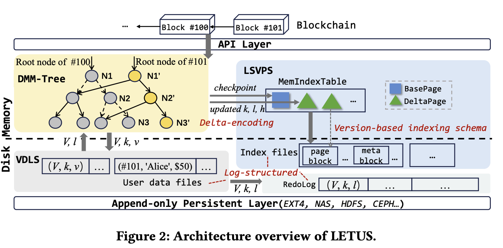
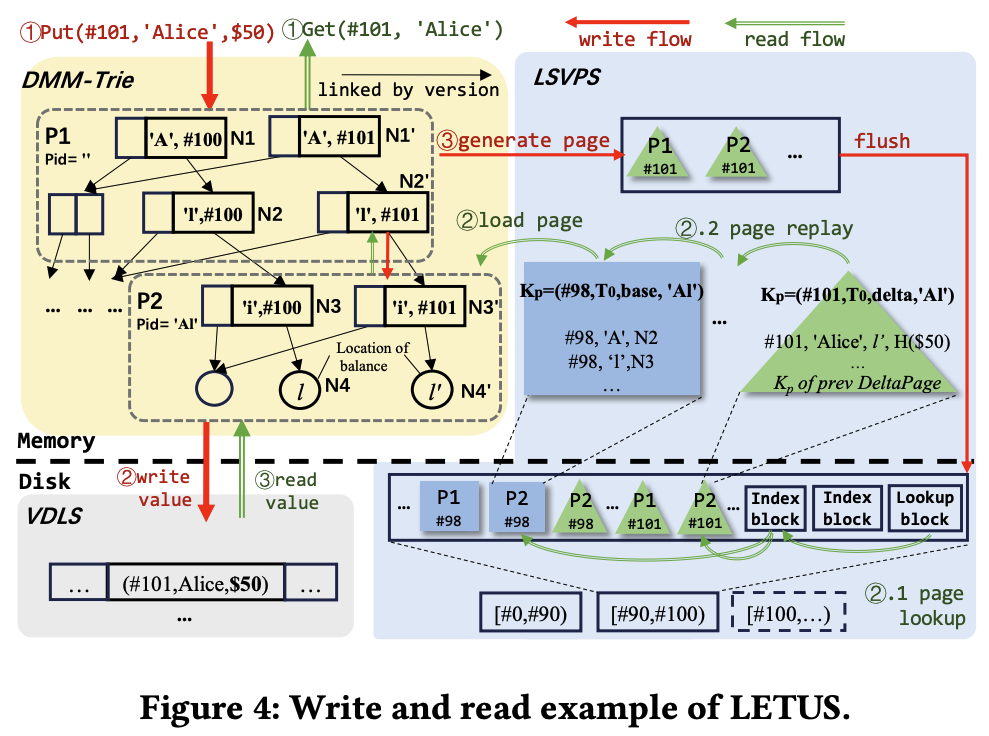

# Letus

## Background

Geth 性能不足，随着数据量的增加和社区研究的不断深入，根因基本达成共识，即存储成为了瓶颈。
类似存储的设计限制了 EVM 的并行，存储在执行的大部分时间，存储消耗了更多系统资源等等，这些说法都是比较笼统的，在此需要准确的描述问题，这样才能对症下药。

首先，明确账户模型，状态模型，存储模型的区别。
1. ETH 设计上采用的账户模型是全局唯一的世界状态；
2. ETH 使用 MPT 的状态模型来实现它的账户模型；
3. geth 使用 hash（或者Ptah， 在 PBSS 模式下） 作为索引，LSM 结构作为存储模型；

根据上述的介绍，也能看出来他们的依赖关系，EVM 无法并行是因为采用了全局的世界状态，即 TX 的修改都在一个数据结构上，限制了它的并发。
是 State Mode 决定了 EVM 的并行情况（即 MPT）。geth 在存储上使用 hash 作为 key，其随机性与 LSM 针对追加写友好随机读不友好的特点相矛盾，造成了系统资源的浪费。
到此，三者的关系可以清晰了，应用层的账户模型选择决定了 State Mode，State Mode 的选择会影响存储模型（存储引擎类型）的选择。

其次，早期的主流是 State Mode 与 Storage Engine 分离的二层架构，随着业界的发展越来越被人诟病，即根据上层业务需要设计 State Mode，在存储层采用通用存储-leveldb/rocksdb，
因为通用存储没有考虑区块链业务的特殊性（leveldb 的 LSM 结构设计之初针对写多读少的场景设计），导致目前占用过多系统资源。目前二者结合成为了业界发展的主流，即存储层针对 State Model 进行深入优化，
不在考虑存储引擎的通用型，而是关注 Chain 本身的特性。

最后，明确一下 Letus 解决了那些 geth 面临的问题，这里需要说一下，Letus 主要的工作是分析 geth 目前的问题，然后针对问题进行了设计。
但是 Account Model（世界状态）是没变的， Letus 更多的是融合了 State Model 和 Storage Model。所以，在介绍 Letus 之前有必要明确目前 geth 的方案有那些问题。

1. 两层架构导致的 I/O 路径长且内存缓存使用不足。
   
   访问一个用户数据的流程，逻辑层：需要先在 MPT 的树结构中遍历到叶子节点；物理上: MPT路径上的每一个节点都会去 leveldb 的 LSM 结构中读取。
   所以一次用户数据访问需要 N 次 MPT 节点方案，需要 N * M 次磁盘访问（M 代表由于 LSM 分层，读一个数据的平均IO次数）。根据论文中的测试结果，geth 平均读放大 74 倍。
   
   由于 MPT 中索引节点都是 hash 指针，而区块链的特点是最近的数据是热数据，缓存无法区分那些是新的数据进行缓存，所以效率并不是很理想。

2. 由树编码引起的 I/O 放大和空间放大。
   
   如果更新 MPT 中一个 trie node 中的一个 slot，需要 copy 整个 trie node，因为 hash 计算的需要，其他的 slot 相当于倍冗余存储了。
   对于 LSM 结构来说加大了 I/O 和 空间方法。

3. 由基于哈希的索引模式的随机性导致的 I/O 带宽的大量使用。

   由于 hash 的随机性，写入的数据是无序的（sst 内有序，sst 文件减无序）。LSM 的 compaction 会异常剧烈，消耗大量 I/O 带宽。 

## Design

LETUS 采用了一种由三个主要组件组成的新架构进行设计：DMM-Tree（Delta-encoded Multi-versionMerkle Tree）、LSVPS（Log-Structured Versioned Page Store）和 VDLS（Versioned Data Logging Stream）。
DMM-Tree 用作内置的多版本 Merkle 树，LSVPS 为跨内存和辅助存储的 DMM-Tree 提供页面抽象方法，而 VDLS 以仅追加模式按顺序存储用户数据。
为了减少 I/O 放大，LETUS 独立存储索引数据和用户数据。具体来说，LETUS 将用户数据保留在 VDLS 中，并且仅在 DMM-Tree 中记录其位置。LSVPS 管理 DMM-Tree 生成的索引数据的页面。

### DMM-Tree

LETUS 打破了传统的两层架构，并直接以页面形式管理 DMM-Trie。与传统数据库为每个页面分配一个节点不同，LETUS 将 DMM-Trie 的一个两层子树整理到一个页面中。它最大限度地减少了 I/O 放大，因为两层子树的大小 (12 KB) 与典型文件系统的块大小 (4 KB) 一致。

为了减少持久化页面时的写入和空间放大，我们提出了增量编码。页面的更新被整合到 DeltaPage 中，而每个页面会定期生成一个检查点作为 BasePage。我们将 BasePage 和 DeltaPage 都称为物理页面。

1. 每个页面容纳一个两层子树，这导致了 16 × 16 = 256 的扇出。
   1. 每个节点都被分配一个 64 位整数 𝑉 ,表示数据版本。
   2. 每个页面也被分配一个页面版本，该版本指示其保存的数据的最新版本。
2. 给定一组键值对，DMM-Trie 的树结构是唯一确定的，因为 DMM-Trie 节点的拆分和合并仅取决于 nibble。这确保了确定性哈希，其中根哈希仅由数据集确定，而与进行更新的顺序无关。
3. 叶节点中的更新后的 𝑘、𝑙 和 ℎ 以及索引节点中的 ℎ𝑐 被写入到相应的 DeltaPage 中，实际上并不是 trienode 级别的更新，而是里面的子节点更新。
4. 当 DeltaPage 累积 𝑇𝑑 个更新时，它会被冻结并启动一个新的活动页面。
5. 每个页面在每次 𝑇𝑏 更新后都会生成一个检查点作为 BasePage。

### LSVPS

DMM-Tree 是内存中的逻辑结构，LSVPS 是内存和磁盘上的物理结构，一个 BasePage 或者 DeltaPage 对应一个 LSVPS 中的页面，由于页面带有 V 版本号，所以 LSVPS 维护的页面在写入之后天然有序（SST 文件间也是有序的，与 hash 索引完全不同）。

LSVPS 仍然是 LSM 结构的存储引擎：
1. 每个索引文件（数据文件）由几个页面块、索引块和一个查找块组成。
   1. 索引块维护从页面键 𝐾𝑃 到页面块位置的映射
   2. 查找块记录从索引块的起始 𝐾𝑃 到其位置的映射
   3. 查找块和索引块充当类似于 B 树的两级索引，以有效地定位页面块。
2. 𝐾𝑃 => (𝑉 ,𝑇𝑖𝑑, 𝑡𝑃, 𝑃𝑖𝑑)
   1. 𝑡𝑃 表示页面类型（即，BasePage 或 DeltaPage）
   2. 𝑇𝑖𝑑 表示 DMM-Trie 的 ID
   3. 𝑉 是严格排序的，版本号，应该页面更该的最大版本号
   4. LSVPS 维护一个内存结构来记录每个索引文件的最小和最大 𝐾𝑃。
3. 页面加载
   1. 可以查找和重放特定版本的 BasePage 和所有后续 DeltaPages。
4. 基于版本的索引
   1. DMM-Trie 中的每个节点和页面都保留一个版本号 𝑉，该版本号记录了其包含的数据的最新版本。
   2. 每个页面都会记录其子页面的版本。
   3. 通过获取子页面的版本，可以构造相应的 𝐾𝑝 以检索 LSVPS 中的页面。
   4. 注意：这个是 MPT 基于版本的索引，用于数据的基于版本的索引不在这，在 VDLS + B 树
5. 由于 𝑉 的单调递增特性，页面本身以 𝑉 的顺序存储，无需内部重新排序或压缩。

### Work Flow

#### Write

1. 操作 Put(#101, ‘Alice’, $50) 首先更新 DMM-Trie，在根页面 P1 中递归生成和更新 N1'、N2'，以及在叶页面 P2 中递归生成和更新 N3'、N4'。
2. 用户数据记录被附加到 VDLS 中，随后将该位置记录在 N4' 中。
3. 页面 P1 和 P2 中的节点更新被打包到 DeltaPages 中。例如，N4' 中 的 修 改 (‘Alice’, 𝑙′ , H($50)) 将记录在 P2 的 DeltaPage 中。
4. 此 DeltaPage 缓存在 MemIndexTable 中，并由 𝐾𝑝 (#101, 𝑇0, delta, ‘Al’) 索引。如果达到大小阈值，MemIndexTable 将作为索引文件刷新，并生成索引块和查找块。

#### Read

1. 如果 DMM-Trie 中的页面 P1 和 P2 在内存缓存中，则递归读取它们。否则，需要从持久层加载它们。
2. 页面加载包含两个步骤：页面查找和页面重放。
   1. 以 P2 为例，查找小于 #101 的最新 BasePage（在本示例中为 #98）。
   2. 然后查找版本在 #98 和 #101 之间的 DeltaPages。
   3. 为了加速加载过程，LETUS 在每个 DeltaPage 中记录最后一个 DeltaPage 的 𝐾𝑝。
   4. 按版本顺序将 DeltaPages 重放到 BasePage。
3. 读取存储在 P2 叶节点中的位置，然后从 VDLS 中的记录中获取 Alice 的最新余额。

## Analyze

下面来看一下针对 geth 的问题 Letus 是怎么处理的。

**Q1: 两层架构导致的 I/O 路径长且内存缓存使用不足。**

LETUS 使用 DMM-Trie ，DMM-Trie 中的 Page（BasePage 或者 DeltaPage）与引擎层 LSVPS 的物理页面一一对应，这就打破了之前的两层架构。
两层架构的打破背后更重要的是读放大没有了，后面介绍这块。

**Q2: 由树编码引起的 I/O 放大和空间放大。**

DMM-Trie 中的 DeltaPage 针对 trie node 中只记录更新的 slot 数据，而不会 copy 其他没有更新的 slot 数据。
能这么做的主要原因是 BasePage 作为基准，DeltaPage 只记录变更部分也是可以的。

**Q3: 由基于哈希的索引模式的随机性导致的 I/O 带宽的大量使用。**

Letus 在设计上在用户数据和Page 级别都支持版本号，并基于此设计的 Kp 索引，所以完全是可以做到基于版本索引数据，避免了 hash 索引的随机性。

### Quantification

1. ETH
   1. 计算公式和结论：写放大-> ｜NodeAvgSize｜O（Nlog16N）
   2. MPT+LevelDB 的放大在测试中达到 74 倍。
2. LETUS
      1. 计算公式和结论：写放大->|ItemAvgeSize|O(log256N) ItemAvgeSize（BasePageSize/Tb） 远小于 NodeAvgSize
      2. LETUS 的在测试中放大仅为 2 倍
3. 结论
   1. 通过打破两层架构，它消除了树编码的放大和后台压缩之间的乘数。
   2. 它通过基于版本的索引模式完全消除了压缩的 O (𝑁𝑘𝑣 ) 放大，LETUS 相当于完全没有压缩放大，因为安版本排序。
   3. 它通过增量编码将系数从 |𝑁𝑜𝑑𝑒 | 进一步降低到小得多的 |𝐵𝑎𝑠𝑒𝑃𝑎𝑔𝑒 |𝑇𝑏，从而有益于磁盘带宽和空间使用

详细的分析可以看一下论文。

## Optimizations

优化这部分，对外的资料不算是很详细，直接介绍了做了什么，细节并不多。在这里就简单的提一下大体的思路。

#### Sharding
   1. 客户端始终保持根节点及其 16 个子节点，从而在系统中产生 16 × 16 = 256 个垂直子树
   2. 256 个子树分布在各个服务器之间，每个服务器充当管理键空间的不同子集的 DMM-Trie 实例
   3. 分片模式通过仅当所有 256 个子树都已提交时才将根哈希提交到区块链来保证强一致性。

#### Block Tiering and State Pruning
   1. Tiering 分层并没有详细的介绍
   2. LSVPS 中的页面修剪
      1. LSVPS 搜索版本 𝑉𝐵 小于或等于 𝑉𝑇 的第一个 BasePage，用于 DMM-Trie 中的每个页面。
      2. 𝑉𝐵 用作边界版本；版本小于 𝑉𝐵 的页面仅包含不必要的数据，可以安全地批量删除。
      3. 由于基于版本的索引模式，物理页面本身是基于版本排序的，从而可以有效地批量处理删除。
      4. 可以写入一个标记的脏页，然后后台扫面相同路径的页面的低版本都会被删除。
   3. VDLS 中的用户数据垃圾收集 (GC)
      1. 当数据文件中垃圾的百分比达到阈值（例如，50%）时，将执行 GC
      2. VDLS 会回收原始数据文件。
      3. 由于 VDLS 中用户数据记录的位置已更新，因此相应地更新存储在相应 BasePages 和 DeltaPages 中的 𝑙。
         1. 说明叶子节点计算hash不考虑 location
#### Recovery from Failure
   1. 由于 LETUS 仅在 DMM-Trie 中记录 VDLS 的键和用户数据位置，因此扫描 VDLS 可能会导致严重的读取放大，特别是对于较大的值大小。
   2. LETUS 引入了 RedoLog 来缓解此问题。

## Adapting Geth

社区里面有一系列文章介绍适配 Geth，这里面确实有很多困难，其中引入了 MyGrid 层来解决两面的兼容性问题，但是只讲了有哪些困难做了什么，细节也不多但实际上这部分并不容易所以真的想用好 Letus 还需要掌握好 MyGrid。

## References

1. [LETUS: A Log-Structured Efficient Trusted Universal BlockChain](https://dl.acm.org/doi/pdf/10.1145/3626246.3653390)
2. [LETUS Meets Ethereum Series](https://openlabs-intl.antdigital.com/0x/Blockchain-Storage-Engine)
