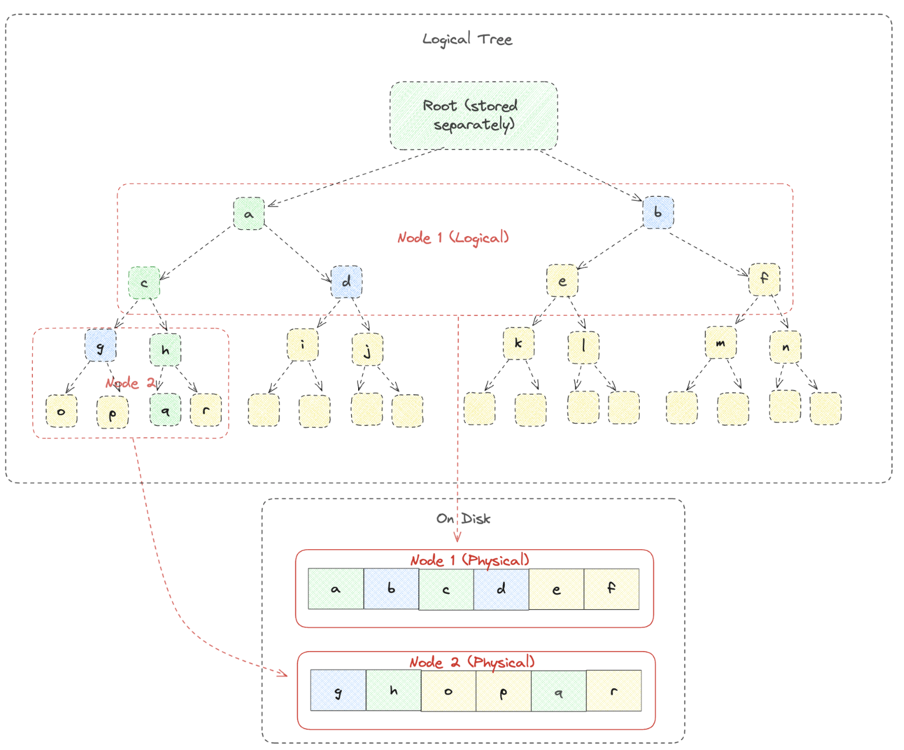

# NOMT

## Overview

NOMT 从三个层次对 ETH-MPT 进行了优化，优化针对的问题还是已经达成共识的二层架构引入的问题。
这三个层次分别是逻辑的树结构，物理存储格式适配 SSD，Hash 计算。本文重点关注前两部分。

## Proposal

首先，树结构变成二叉树，内部不再是 16 路的树节点，在物理组织上 6 层（图中实例是 2 层）无根的两个兄弟子树组织（内存和磁盘）在一个页面内，跟节点在上层的页面中。
这样做最大的好处是更新或者获取 proof 的时候，需要的兄弟节点都在一个页面组织中，节省磁盘 IO。至于从 16 叉变成 2 叉，最主要的考虑也是 Hash 计算，更新一个阶段不需要多次未更新节点的 hash 作为输入。

其次，看一下物理层，一个物理页面是 4096 字节，6 层无根的两个兄弟子树，需要 4032 =（2^6 - 1） * 2 * 32 字节的空间，剩余的 64 个字节用于记录页面的元数据。树空间是 2^256 一个页面是 2^6 空间，
所以一共有 2^250 个页面，我们对每一个页面进行编号，那么一次用户的逻辑更新（更新一个叶子节点）就可以并行的将路径上的页面在一个磁盘往返时间加载上来。这也是充分利用 SSD 控制器并发的特点。这个编码的方式并不是很复杂，比较常见就不再次赘述了。

其实，前两部分的介绍正式 NOMT 的精髓，后面是针对叶子节点和 hash 计算以及 FlatKV 用于优化等的介绍，是工程实现的重要部份，但并不是设计优化上的重点，并且也没有太大的亮点不再赘述。

## References

1. [Nearly Optimal State Merklization](https://sovereign.mirror.xyz/jfx_cJ_15saejG9ZuQWjnGnG-NfahbazQH98i1J3NN8)
2. [Introducing NOMT](https://www.rob.tech/blog/introducing-nomt/)
3. [Rocksdb Merge Operator](https://github.com/facebook/rocksdb/wiki/merge-operator)
