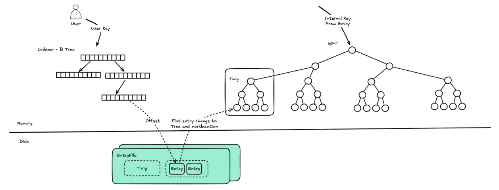
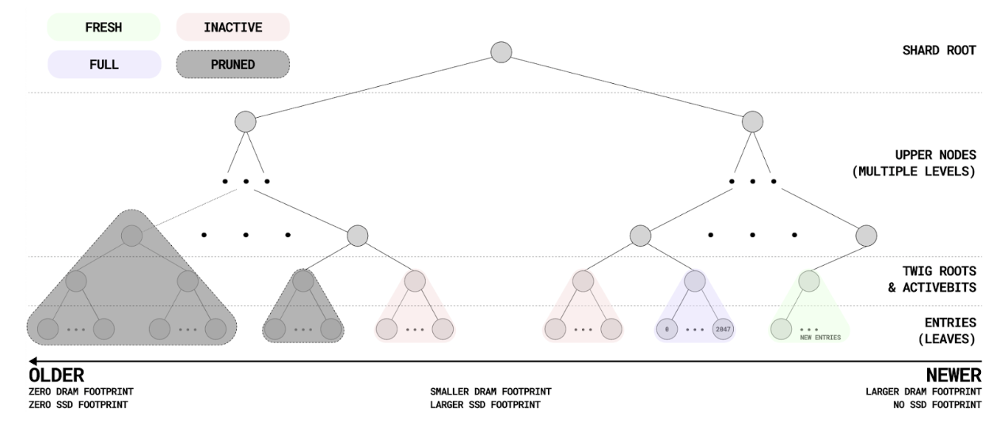
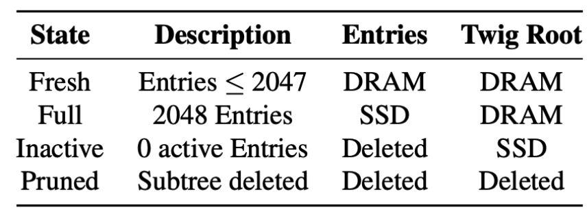
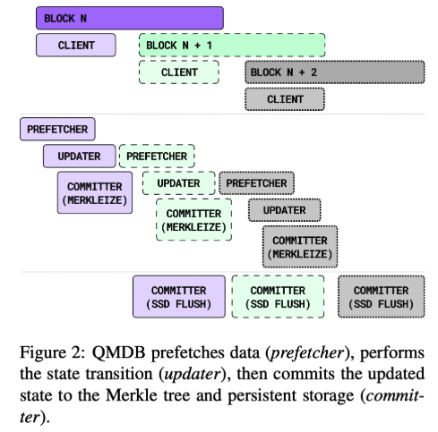

# QMDB
## Key Feature
### Single-Layer Architecture
In the blockchain, single-layer storage design is widely embraced due to its understanding of performance bottlenecks from common storage and MPT's two-layer architecture. QMDB integrates physical design elements(memory/disk data formats and disk access methods) for state operations (CRUD/Merklezation/Proof), featuring a distinct single-layer architecture that optimizes resource use and boosts performance.

### In-Memory Merklezation
QMDB's layered design for MPT facilitates complete in-memory merklezation. Its shard architecture allows for parallel execution, while the specialized data structure for entries ensures that merklezation for each shard involves only the computation of a single path branch(It seems to consider only writes without deletions). Remarkably, this entire computation process is conducted without any disk operations.

### Append-only
State updates in QMDB are executed as append-only writes, one of the most efficient ways to optimize disk utilization. It utilizes marking deletions (ActiveBits) to minimize disk operations and fragmentation while employing file truncation for actual deletions to counteract the downsides of GC. While these are not new, the real innovation lies in how QMDB integrates them with the MPT.

### Resource Efficient
The ordered design of keys enables an update to produce one read and one write, a creation to produce one read and two writes, and a deletion to produce two reads and one write. This offers a significant advantage over LSM, which often suffers from dozens to hundreds of times greater read and write amplification. Moreover, writes are not immediately sent to disk; instead, they accumulate until reaching a threshold (2048, twig size) for batch sequential writing, further enhancing performance.

The specialized entry design enables online pruning, and the flat and compression design of the twig(explained below) significantly reduces storage space usage. This makes it possible for the system to run efficiently on both consumer hardware and enterprise servers.

## Design



_Notice: this section is primarily based on the QMDB paper, with some content referencing the QMDB code implementation of LayerZero._

QMDB consists of three main components:
1. MPT: primarily used for merkleization, where the index is a monotonically increasing internal key. Its monotonically incremental ensures that all insertions are in the latest one Twig(explained below).
2. Indexer: allows users to query the offset where the user data is located in the disk file by user-key. It employs the B-tree structure, which saves memory.
3. EntryFile: the disk file that stores the user data, managed internally by Twigs(explained below). Each Twig contains sequentially stored Entries that hold both the real user data and metadata.

## MPT


QMDB’s state tree is architected as a binary Merkle tree illustrated in the Figure. At the top is a single global root that connects a set of shard roots, each of which represents the subtree of the world state that is managed by an independent QMDB shard. The shard root itself is connected to a set of upper nodes, which, in turn, are connected to fixed-size subtrees called twigs;

### Twig
Twigs are subtrees within QMDB’s Merkle Tree; each twig has a fixed depth, by extension, a fixed number of entries stored in the leaf nodes of the same depth (2048 in our implementation). The nodes between the root node and the Twig are upper nodes. Taking BSC as an example, the maximum tree height is currently around 12 or 13 layers, so there is only one layer of upper nodes, and the upper nodes are fully in-memory. The 16 subnodes of the root node correspond to 16 shards, and operations between shards are performed in parallel.



Each twig follows a lifecycle of 4 states: Fresh, Full, Inactive, and Pruned (Table 2).
1. Fresh: Each shard has only one, and all updates can only be inserted into the Fresh Twig.
2. Full: When the number of written entries reaches the limit, compression occurs, retaining only the Twig’s root hash and ActiveBits (a bitmap representing the active status of entries; if an entry is deleted, the corresponding bit is set to false). The actual entries will be written to disk, and memory will be freed.
3. Inactive: All entries within the twig have been deleted, at which point the Twig no longer provides data (removed from memory) and waits for the corresponding disk data to be reclaimed.
4. Pruned: twigs deleted during the GC phase, at which point both memory and disk space have been reclaimed.

Each insertion will only update the Fresh Twig, as the keys in the MPT are internally maintained as monotonically increasing keys (introduced below). This ensures that each update affects adjacent leaf nodes. Once the Fresh Twig is filled, it becomes a Full Twig and will no longer be updated. If entries are deleted from it, only the ActiveBits will mark them as deleted without actually removing the data. Every deletion and update will trigger Merklezation.

Only the Fresh Twig exists in memory as a tree structure; Inactive and Pruned Twigs are not recorded in memory. The remaining Active Twigs (either Full or partially deleted Entries) will be compressed and stored in memory as the root hash and ActiveBits.

_In a hypothetical scenario with 230 entries (approx. 1 billion), the system must keep at most 219 ( 230 / 2048 ) * 288-byte (32-byte twig root hash & 2048-bit ActiveBits bitmap) full twigs, 1 fresh twig, and 219− 1 * 32-byte (node hash) upper nodes totaling around 160 MB._

**Conclusion**: All nodes used by Merkleization can be stored in a small amount of DRAM.

## Indexer && CRUD

The indexer maps the application-level keys to their respective entries, enabling QMDB’s CRUD interface. QMDB’s default in-memory indexer will meet the resource requirements of the majority of use cases. 

Using just 16 gigabytes of DRAM, the in-memory indexer can index more than 1 billion entries, making it suitable for a wide range of applications. QMDB chose the B-tree map as the basis for the underlying structure of the default indexer to take advantage of B-tree’s high cache locality, low memory overhead, support for ordered key iteration, and graceful handling of key collisions.

**Conclusion**: Indexer support ordered key iteration and in-memory.


For brevity, Entry is defined as:
E = (Key, NextKey, OldId, OldNextKeyId)

### Read
Query the indexer for the file offset of the entry corresponding to a given user-key; this file offset is used to read the entry in a single SSD IO.

### Update
1. Reads the most current entry for the updated key.
    1. Mark the old entry as inactive if the entry is not in the fresh twig.
2. Appends a new entry to the fresh twig.
    1. E' = (K, E.nextKey, E.Id, E.OldNextKeyId)

Incurs 1 SSD read and 1 entry write.

### Create
1. Read the entry Ep corresponding to the lexicographic predecessor (prevKey) to the created key K.
    1. Ep.Key < K < Ep.nextKey
2. Two new Entries are appended to the fresh twig
    1. EK = (K, Ep.nextKey, Ep.Id, En.Id) 
    2. E′p = (prevKey, K, Ep.Id, En.OldId)

Incurs 1 SSD read and 2 entry writes.

### Delete
1. Set the ActiveBit to false for the most current entry corresponding to K.
2. Update the entry for prevKey.
    1. E ′ p = (prevKey, EK.nextKey, Ep.Id, EK.OldNextKeyId)

Incurs 2 SSD reads and 1 entry write.

**The nextKey in Entry acts like a linked list, connecting user keys for ordered key iteration.** QMDB uses OldId and OldNextKeyId to form a graph that enables the tracing of keys over time and space despite updates, deletions, and insertions. OldId links the current entry to the last inactive entry with the same key, and OldNextKeyId links to the entry previously referenced by NextKey (when the entry for NextKey is deleted).

_Notice: [QMDB](https://github.com/LayerZero-Labs/qmdb) code implementation of LayerZero queries historical data not through OldId and OldNextKeyId, but rather through history_file._

### Proof
#### Inclusion
Query the corresponding file offset from the indexer.
Get the proof on MPT by Entry.serial_number(introduced below).
#### Exclusion
Proved by presenting the inclusion proof of E such that E.Key < K < E.nextKey. Indexer supports efficient iteration by key, so E can be located quickly by querying the lexicographic predecessor to K.

### Entry
```rust
pub struct Entry<'a> {
    pub key: &'a [u8],
    pub value: &'a [u8],
    pub next_key_hash: &'a [u8],
    pub version: i64,
    pub serial_number: u64,
}
```

The data structure of Entry is shown above, where the serial_number is an internally maintained monotonically increasing key used to index leaf nodes in the MPT.

Entries are written to the EntryFile for persistence, and as the twig is updated, entries are appended to the end of the EntryFile in an append-only manner. Each shard maintains one EntryFile, where the higher bits of the serial_number are used to locate the shard, and the lower bits are used to index data within the twig. The EntryFile will not be split into multiple files due to size, time, or other factors. A twig is the logical unit that manages entries, and during the GC phase, entries are deleted from the EntryFile based on the twig granularity.

### Parallelization


State updates are parallelized in QMDB through sharding and pipelining. 

### GC
In the design of the QMDB paper, a dedicated garbage collection thread duplicates old valid entries into the fresh twig, thereby reducing fragmentation and allowing larger subtrees to be pruned.

In the LayerZero implementation, truncation is performed at the head of the EntryFile at the twig granularity per PRUNE_EVERY_NBLOCKS(500) blocks, and each time, at least MIN_PRUNE_COUNT (default 2) twigs of data are truncated. The head twig contains the oldest data, and if the oldest twig has active entries, garbage collection (GC) will not be performed.

# Q&A

### Q1: What is the biggest highlight of QMDB?
The two key highlights of the complete in-memory Merklezation and append-only writes enable QMDB to achieve high performance.

### Q2: Is the Merkleization of QMDB indeterministic, and is it related to the order of data writes?
Yes, Merklezation is related to the order of data writes.

The serial_number is included in the hash calculation. The consequence of this is that different writing orders will result in different assigned serial_numbers to entry, leading to different final computed entry hashes. The parallel execution of tx within a block is not feasible.

### Q3: How is the garbage collection (GC) going in QMDB?
Currently, there is a significant issue: when the oldest twig has only a few active entries, garbage collection (GC) will not work, even if all entries in the later twigs are inactive, leading to wasted space.
The design in the paper is ideal, but migrating entries can affect the results of Merklezation (as mentioned in Q2), which requires consensus at the consensus layer.
